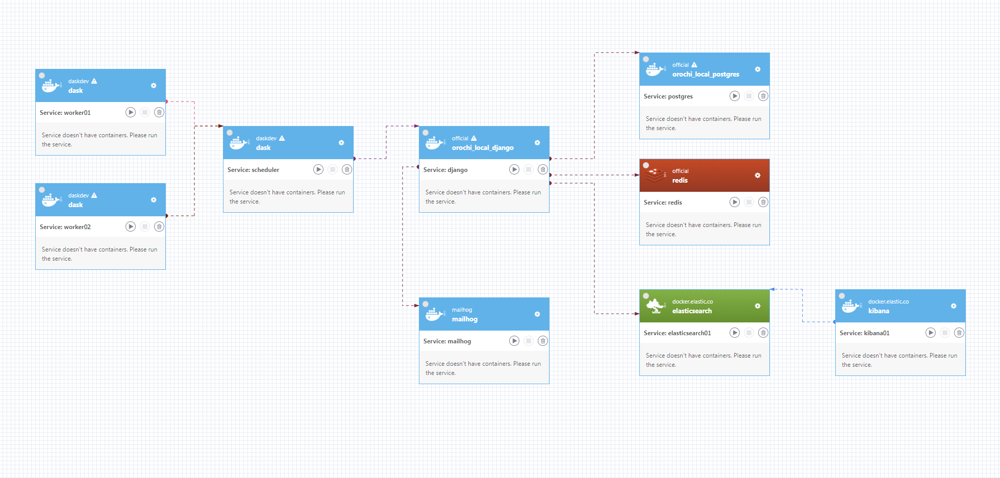

# Orochi

[](http://shields.io/)
[](https://github.com/LDO-CERT/orochi/blob/master/LICENSE)
[](https://github.com/pydanny/cookiecutter-django/)
[](https://github.com/LDO-CERT/orochi/actions/workflows/push.yml)
[](https://github.com/LDO-CERT/orochi/actions/workflows/codeql-analysis.yml)
[](https://bestpractices.coreinfrastructure.org/projects/5014)
[](https://gitter.im/ldo-cert-orochi?utm_source=badge&utm_medium=badge&utm_campaign=pr-badge&utm_content=badge)

Orochi - The Volatility Collaborative GUI


## Table of Contents

- [Orochi](#orochi)
  - [Table of Contents](#table-of-contents)
  - [About Orochi](#about-orochi)
  - [Fastest way to try Orochi](#fastest-way-to-try-orochi)
  - [Orochi architecture](#orochi-architecture)
  - [Getting started](#getting-started)
    - [Installation](#installation)
    - [Quick Start Guide](#quick-start-guide)
    - [User guide](#user-guide)
    - [Admin guide](#admin-guide)
    - [API guide](#api-guide)
    - [Deploy to Swarm](#deploy-to-swarm)
  - [Community](#community)
  - [Contributing](#contributing)
  - [Origin of name](#origin-of-name)

## About Orochi

Orochi is an open source framework for collaborative forensic memory dump analysis. Using Orochi you and your collaborators can easily organize your memory dumps and analyze them all at the same time.


## Fastest way to try Orochi

For people who prefer to install and try first and then read the guide:

```
git clone https://github.com/LDO-CERT/orochi.git
cd orochi
sudo docker-compose up
```

Browse https://localhost and access with admin//admin
At the first run is necessary to download the Volatility plugins and download the common Volatility symbols.
This can be done from the admin page (see in admin section) or from command line (see below).

## Orochi architecture

- **[Volatility 3]** (https://github.com/volatilityfoundation/volatility3): The world’s most widely used framework for extracting digital artifacts from volatile memory (RAM) samples.
- **[Dask]** (https://github.com/dask/dask): Used for distributing loads among nodes.
- **[PostgreSQL]** (https://www.postgresql.org/): Stores users and analysis metadata (such as status and errors).
- **[Mailpit]** (https://github.com/axllent/mailpit): Manages user registration emails.
- **[Django WSGI]** (https://www.djangoproject.com/): Handles standard, synchronous request/response cycles (HTML pages and APIs).
- **[Django ASGI]** (https://channels.readthedocs.io/): Specifically manages asynchronous events, primarily for **WebSockets** used in real-time notifications.
- **[Redis]** (https://github.com/redis/redis): Serves as the **channel layer** for the Django ASGI/WebSockets and for general-purpose caching.
- **[Nginx]** (https://github.com/nginx/nginx): Functions as a reverse proxy.

- **[Docker Compose]** (https://docs.docker.com/compose/): Used to provide the entire framework as deployable images, supporting both **x64** and **arm64** architectures.

## Getting started

### Installation

**Multi-Architecture Support:** The project's Docker images are built for both **x64 (amd64)** and **arm64** architectures, ensuring native performance on modern hardware (e.g., Apple Silicon M-series).

Using Docker-compose you can start multiple dockers and link them together.

- Start cloning the repo and enter in the folder:

```
git clone https://github.com/LDO-CERT/orochi.git
cd orochi
```

- You need to set some useful variables that docker-compose will use for [configure the environment](https://cookiecutter-django.readthedocs.io/en/latest/developing-locally-docker.html#configuring-the-environment)

  Here is a sample of `.env\.local\.postgres`:

  ```
  POSTGRES_HOST=postgres
  POSTGRES_PORT=5432
  POSTGRES_DB=orochi
  POSTGRES_USER=debug
  POSTGRES_PASSWORD=debug
  ```

  Here is a sample of `.env\.local\.django`:

  ```
  USE_DOCKER=yes
  IPYTHONDIR=/app/.ipython
  REDIS_URL=redis://redis:6379/0
  DASK_SCHEDULER_URL=tcp://scheduler:8786
  ```

  By default `ALLOWED_HOSTS` config permits access from everywhere. If needed you can change it from `.envs\.local\.django`

- If needed you can increase or decrease Dask workers to be started. In order to do this you have to update the `docker-compose.yml` file changing the number of `replicas` in the deploy section of `worker` service.

- You can pull images with command:

```
docker-compose pull
```

- Or build images with command:

```
docker-compose build
```

- Now it's time to fire up the images!

```
docker-compose up
```

- When finished - it takes a while - you can check the status of images:

```
docker ps -a
```

````
NAME                 IMAGE                                COMMAND                  SERVICE       CREATED       STATUS                 PORTS
orochi-worker-2      ghcr.io/ldo-cert/orochi_worker:new   "/usr/bin/tini -g --…"   worker        5 weeks ago   Up 5 weeks
orochi_django_asgi   ghcr.io/ldo-cert/orochi_django:new   "/entrypoint daphne …"   django_asgi   5 weeks ago   Up 5 weeks             9000/tcp
orochi_django_wsgi   ghcr.io/ldo-cert/orochi_django:new   "/entrypoint /start"     django_wsgi   5 weeks ago   Up 5 weeks             8000/tcp
orochi_mailpit       axllent/mailpit:latest               "/mailpit"               mailpit       5 weeks ago   Up 5 weeks (healthy)   0.0.0.0:1025->1025/tcp, :::1025->1025/tcp, 0.0.0.0:8025->8025/tcp, :::8025->8025/tcp, 1110/tcp
orochi_nginx         ghcr.io/ldo-cert/orochi_nginx:new    "/docker-entrypoint.…"   nginx         5 weeks ago   Up 2 weeks (healthy)   0.0.0.0:80->80/tcp, :::80->80/tcp, 0.0.0.0:443->443/tcp, :::443->443/tcp, 8080/tcp
orochi_postgres      postgres:16.2                        "docker-entrypoint.s…"   postgres      5 weeks ago   Up 5 weeks             0.0.0.0:5432->5432/tcp, :::5432->5432/tcp
orochi_redis         redis:6.2.5                          "docker-entrypoint.s…"   redis         6 weeks ago   Up 5 weeks             0.0.0.0:6379->6379/tcp, :::6379->6379/tcp
orochi_scheduler     ghcr.io/ldo-cert/orochi_worker:new   "/usr/bin/tini -g --…"   scheduler     5 weeks ago   Up 5 weeks             0.0.0.0:8786-8787->8786-8787/tcp, :::8786-8787->8786-8787/tcp

 ```
````



- Now some management commands in case you are upgrading:
  ```
   docker-compose run --rm django python manage.py makemigrations
   docker-compose run --rm django python manage.py migrate
   docker-compose run --rm django python manage.py collectstatic
  ```
- Sync Volatility plugins (\*) in order to make them available to users:
  ```
  docker-compose run --rm django python manage.py plugins_sync
  ```
- Volatility Symbol Tables are available [here](https://github.com/volatilityfoundation/volatility3#symbol-tables) and can be sync using this command (\*):

  ```
  docker-compose run --rm django python manage.py symbols_sync
  ```

  (\*) It is also possible to run plugins_sync and symbols_sync directly from the admin page in case new plugins or new symbols are available.

- To create a **normal user account**, just go to Sign Up (https://127.0.0.1) and fill out the form. Once you submit it, you'll see a "Verify Your E-mail Address" page. Go to your console to see a simulated email verification message. Copy the link into your browser. Now the user's email should be verified and ready to go.
  In development, it is often nice to be able to see emails that are being sent from your application. For that reason local SMTP server [Mailpit](https://github.com/axllent/mailpit) with a web interface is available as docker container.
  Container mailpit will start automatically when you will run all docker containers.
  Please check `cookiecutter-django Docker documentation` for more details how to start all containers.
  With Mailpit running, to view messages that are sent by your application, open your browser and go to `http://127.0.0.1:8025`

- Other details in [cookiecutter-django Docker documentation](http://cookiecutter-django.readthedocs.io/en/latest/deployment-with-docker.html)

### Quick Start Guide

- register your user
- login with your user and password
- upload a memory dump and choose a name, the OS and the color: in order to speed up the upload it accepts also zipped files.
- When the upload is completed, all enabled Volatility plugins will be executed in parallel thanks to Dask. With Dask it is possible to distribute jobs among different servers.
- You can configure which plugin you want run by default through admin page.
- As the results come, they will be shown.
- Is it possible to view the results of a plugin executed on multiple dumps, for example view simultaneously processes list output of 2 different machines.

Applications links:

- Orochi homepage: https://127.0.0.1
- Orochi admin: https://127.0.0.1/admin
- Mailpit: http://127.0.0.1:8025
- Dask: http://127.0.0.1:8787

### User guide

Please see [Users-Guide](docs/Users-Guide.md)

### Admin guide

Please see [Admin-Guide](docs/Admin-Guide.md)

### API guide

Please see [API-Guide](docs/API-Guide.md)

### Deploy to Swarm

Please see [Deploy-to-Swarm](docs/Deploy-to-Swarm-Guide.md)

## Community

We are available on [Gitter](https://gitter.im/ldo-cert-orochi/community) to help you and discuss about improvements.

## Contributing

If you want to contribute to orochi, be sure to review the [contributing guidelines](CONTRIBUTING.md). This project adheres to orochi
[code of conduct](CODE_OF_CONDUCT.md). By participating, you are expected to uphold this code.

## Origin of name

"Its eyes are like akakagachi, it has one body with eight heads and eight tails. Moreover on its body grows moss, and also chamaecyparis and cryptomerias. Its length extends over eight valleys and eight hills, and if one look at its belly, it is all constantly bloody and inflamed."
[Full story from wikipedia](https://en.wikipedia.org/wiki/Yamata_no_Orochi)

Let's go cut tails and find your Kusanagi-no-Tsurugi!
