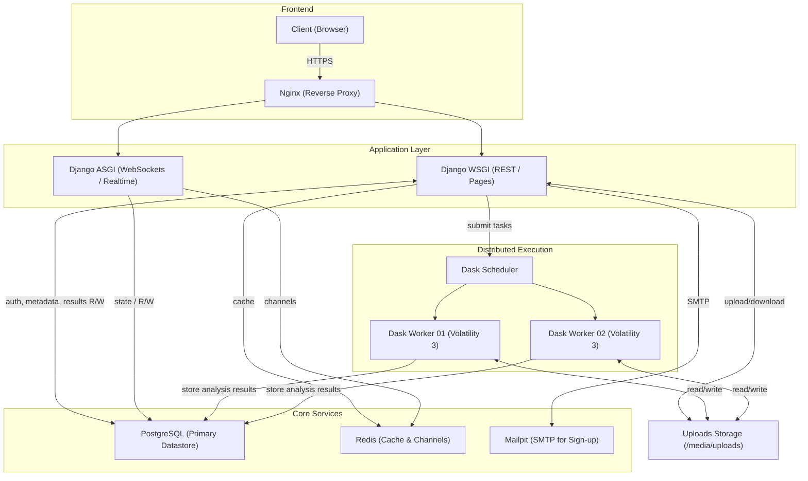

# Orochi

[](http://shields.io/)
[](https://github.com/LDO-CERT/orochi/blob/master/LICENSE)
[](https://github.com/pydanny/cookiecutter-django/)
[](https://github.com/LDO-CERT/orochi/actions/workflows/push.yml)
[](https://github.com/LDO-CERT/orochi/actions/workflows/codeql-analysis.yml)
[](https://bestpractices.coreinfrastructure.org/projects/5014)
[](https://gitter.im/ldo-cert-orochi?utm_source=badge&utm_medium=badge&utm_campaign=pr-badge&utm_content=badge)

---

> 🧠 **Orochi** — A modern, distributed web interface for collaborative memory forensics built on **Volatility 3**, **Django**, and **Dask**.


---

## Table of Contents

- [About Orochi](#about-orochi)
- [Fastest Way to Try Orochi](#fastest-way-to-try-orochi)
- [Architecture Overview](#architecture-overview)
- [Getting Started](#getting-started)
  - [Installation](#installation)
  - [Quick Start Guide](#quick-start-guide)
  - [Video Guide](#video-guide)
- [Documentation](#documentation)
- [Community](#community)
- [Contributing](#contributing)
- [Origin of the Name](#origin-of-the-name)

---

## About Orochi

**Orochi** is an open-source framework for collaborative forensic memory dump analysis.  
It lets multiple analysts upload, analyze, and correlate memory dumps simultaneously via an intuitive web interface.


---

## 🚀 Fastest Way to Try Orochi <a id="fastest-way-to-try-orochi"></a>

If you just want to get hands-on immediately:

```bash
git clone https://github.com/LDO-CERT/orochi.git
cd orochi
sudo docker-compose up
```

Then open [https://localhost](https://localhost) and log in with:  
**Username:** `admin` **Password:** `admin`

At first run, Orochi will need to download **Volatility plugins** and **symbol files**.  
You can do this directly from the **Admin Page** or by running the management commands described below.

---

## ⚙️ Architecture Overview <a id="architecture-overview"></a>

Orochi combines the power of Volatility 3 with distributed task management and a modern web stack:

- 🧩 **[Volatility 3](https://github.com/volatilityfoundation/volatility3):** Memory forensics framework for extracting digital artifacts.
- ⚙️ **[Dask](https://github.com/dask/dask):** Parallel computing library that distributes plugin execution across workers.
- 🗄️ **[PostgreSQL](https://www.postgresql.org/):** Database for user and analysis metadata.
- ✉️ **[Mailpit](https://github.com/axllent/mailpit):** Local SMTP service for user registration emails.
- 🧱 **[Django WSGI / ASGI](https://www.djangoproject.com/):** Core web backend, including real-time WebSocket updates.
- 🔁 **[Redis](https://github.com/redis/redis):** Message broker and cache for asynchronous communications.
- 🌐 **[Nginx](https://github.com/nginx/nginx):** Reverse proxy providing HTTPS termination.
- 🐳 **[Docker Compose](https://docs.docker.com/compose/):** Orchestrates the entire Orochi stack for both x64 and arm64 platforms.



---

## 🧰 Getting Started <a id="getting-started"></a>

### Installation

Orochi supports **multi-architecture builds** for both `x64 (amd64)` and `arm64` systems (e.g., Apple Silicon).

#### Clone the Repository

```bash
git clone https://github.com/LDO-CERT/orochi.git
cd orochi
```

#### Configure Environment Variables

Set your environment configuration in `.envs/.local/.postgres`:

```
POSTGRES_HOST=postgres
POSTGRES_PORT=5432
POSTGRES_DB=orochi
POSTGRES_USER=debug
POSTGRES_PASSWORD=debug
```

And `.envs/.local/.django`:

```
USE_DOCKER=yes
IPYTHONDIR=/app/.ipython
REDIS_URL=redis://redis:6379/0
DASK_SCHEDULER_URL=tcp://scheduler:8786
```

> 💡 **Tip:** You can adjust the number of Dask workers in `docker-compose.yml` by editing the `replicas` value under the **worker** service.

#### Build or Pull the Images

To pull prebuilt images:

```bash
docker-compose pull
```

Or build locally:

```bash
docker-compose build
```

#### Start the Stack

```bash
docker-compose up
```

Check the running containers:

```bash
docker ps -a
```

Example output:

```
NAME                 IMAGE                                COMMAND                  SERVICE       STATUS
orochi-worker-2      ghcr.io/ldo-cert/orochi_worker:new   "/usr/bin/tini -g --…"   worker        Up 5 weeks
orochi_nginx         ghcr.io/ldo-cert/orochi_nginx:new    "/docker-entrypoint.…"   nginx         Up 2 weeks (healthy)   0.0.0.0:443->443/tcp
...
```

Once the containers are running, Orochi will be available at:  
🔗 [https://127.0.0.1](https://127.0.0.1)

#### Update & Sync Plugins / Symbols

```bash
docker-compose run --rm django python manage.py plugins_sync
docker-compose run --rm django python manage.py symbols_sync
```

> ⚙️ These commands can also be executed directly from the Admin page if new plugins or symbols are available.

---

### ⚡ Quick Start Guide <a id="quick-start-guide"></a>

1. Register a user via **Sign Up**
2. Log in with your credentials
3. Upload a memory dump (supports `.raw`, `.mem`, and zipped files)
4. Choose the OS and optional color label
5. Orochi automatically runs the enabled Volatility plugins in parallel via **Dask**
6. View results, compare dumps, and bookmark findings

**Default URLs:**

| Service         | URL                                                |
| --------------- | -------------------------------------------------- |
| Orochi Homepage | [https://127.0.0.1](https://127.0.0.1)             |
| Admin Panel     | [https://127.0.0.1/admin](https://127.0.0.1/admin) |
| Mailpit         | [http://127.0.0.1:8025](http://127.0.0.1:8025)     |
| Dask Dashboard  | [http://127.0.0.1:8787](http://127.0.0.1:8787)     |

---

## 🎥 Video Guide <a id="video-guide"></a>

[](https://youtu.be/9g8EfC0OK7k)

**Watch a complete 15-minute setup and walkthrough** showing how to install, configure, and use Orochi.

**Guide Timestamps:**

- **00:00** ➡️ _Introduction:_ Cloning the GitHub repository
- **00:30** ➡️ _Docker Launch:_ Starting Orochi with `docker-compose up`
- **03:00** ➡️ _Platform Access:_ Opening the web interface
- **03:35** ➡️ _Admin Configuration:_ Downloading plugins & symbols
- **04:00** ➡️ _Dask Monitoring:_ Observing parallel analysis tasks
- **05:20** ➡️ _Memory Dump Upload:_ Uploading and analyzing a file
- **10:45** ➡️ _Download Process:_ Retrieving dumped artifacts
- **12:15** ➡️ _Regipy Plugins:_ Viewing parsed registry data
- **12:40** ➡️ _Hex Viewer:_ Navigating memory data in hex
- **14:35** ➡️ _Bookmarks:_ Saving and revisiting filtered results

---

### 📘 Documentation <a id="documentation"></a>

- [Users Guide](docs/Users-Guide.md)
- [Admin Guide](docs/Admin-Guide.md)
- [API Guide](docs/API-Guide.md)
- [Deploy to Swarm Guide](docs/Deploy-to-Swarm-Guide.md)

---

## 👥 Community <a id="community"></a>

Join discussions and get help on [Gitter](https://gitter.im/ldo-cert-orochi/community).  
We welcome questions, feedback, and new ideas to improve Orochi!

> 💡 **Tip:** You can also open GitHub Discussions or Issues directly in this repository.

---

## 🤝 Contributing <a id="contributing"></a>

We love community contributions!  
Please review the [Contributing Guidelines](CONTRIBUTING.md) and [Code of Conduct](CODE_OF_CONDUCT.md).

> 🧩 Pull requests are welcome — from typo fixes to new integrations and plugin improvements.

---

## 🐉 Origin of the Name <a id="origin-of-the-name"></a>

> _"Its eyes are like akakagachi, it has one body with eight heads and eight tails. Moss and cypress grow on its back, its belly is constantly bloody and inflamed."_

[Read the full legend on Wikipedia →](https://en.wikipedia.org/wiki/Yamata_no_Orochi)

🗡️ _Let's go cut tails and find your Kusanagi-no-Tsurugi!_

---

© 2025 LDO-CERT — Collaborative Memory Forensics Platform
