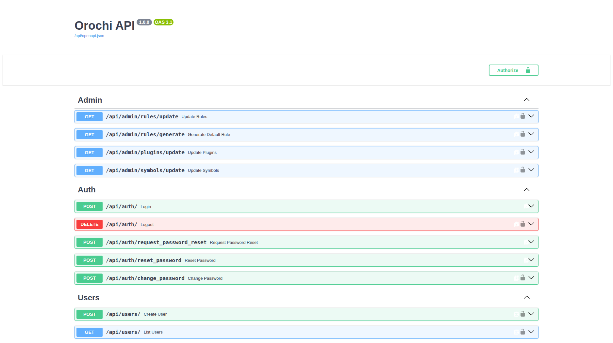

# Orochi API Guide

_Version 2.5.0 — 2026_  
_Comprehensive REST API and Developer Integration Reference_

---

## Table of Contents

- [Overview](#overview)
- [Authentication](#authentication)
- [Interactive API Documentation (Swagger & ReDoc)](#interactive-api-documentation-swagger--redoc)
- [API Endpoints Reference](#api-endpoints-reference)
  - [1. Folders API (`/api/folders/`)](#1-folders-api-apifolders)
  - [2. Dumps API (`/api/dumps/`)](#2-dumps-api-apidumps)
  - [3. Plugins API (`/api/plugins/`)](#3-plugins-api-apiplugins)
  - [4. Task Management & Dask Operations (`/api/utils/`)](#4-task-management--dask-operations-apiutils)
  - [5. Bookmarks API (`/api/bookmarks/`)](#5-bookmarks-api-apibookmarks)
  - [6. YARA Rules API (`/api/rules/` & `/api/customrules/`)](#6-yara-rules-api-apirules--apicustomrules)
  - [7. Symbols API (`/api/symbols/`)](#7-symbols-api-apisymbols)
- [Python Integration Example](#python-integration-example)
- [Jupyter Demo Notebook](#jupyter-demo-notebook)

---

## Overview

Orochi provides a high-performance REST API powered by **[Django-Ninja](https://django-ninja.dev/)** and **Pydantic v2**, offering automatic request validation, type-safe serialization, and OpenAPI 3.0 schemas.

All API routes are accessible under the `/api/` prefix.

---

## Authentication

The API uses Django session-based authentication (`django_auth`).

1. Log in via the Orochi web interface at `https://localhost` (or authenticate via `POST /users/login/`).
2. Pass the standard session cookie (`sessionid`) and CSRF token (`csrftoken` with header `X-CSRFToken`) in automated HTTP requests.

---

## Interactive API Documentation (Swagger & ReDoc)

Orochi automatically generates interactive OpenAPI documentation:

- **Swagger UI**: [https://localhost/api/docs](https://localhost/api/docs)
- **OpenAPI Schema (JSON)**: [https://localhost/api/openapi.json](https://localhost/api/openapi.json)



---

## API Endpoints Reference

### 1. Folders API (`/api/folders/`)

Organize memory dumps into logical folder hierarchies.

| Method   | Endpoint               | Description                                  | Permissions    |
| -------- | ---------------------- | -------------------------------------------- | -------------- |
| `GET`    | `/api/folders/`        | List all folders accessible to user          | Authenticated  |
| `POST`   | `/api/folders/`        | Create a new folder                          | Non-ReadOnly   |
| `DELETE` | `/api/folders/{name}`  | Delete an existing folder by name            | Folder Owner   |

**Example: Create a Folder**
```http
POST /api/folders/ HTTP/1.1
Content-Type: application/json

{
  "name": "incident-alpha-2026"
}
```

---

### 2. Dumps API (`/api/dumps/`)

Upload, inspect, update, and delete memory captures.

| Method   | Endpoint                 | Description                                  | Permissions    |
| -------- | ------------------------ | -------------------------------------------- | -------------- |
| `GET`    | `/api/dumps/`            | List all memory dumps with filter parameters | Authenticated  |
| `POST`   | `/api/dumps/`            | Register / upload a new memory dump          | Non-ReadOnly   |
| `GET`    | `/api/dumps/{index}`     | Get detailed dump metadata and hashes        | Dump Viewer    |
| `PATCH`  | `/api/dumps/{index}`     | Update dump metadata (name, color, folder)   | Dump Owner     |
| `DELETE` | `/api/dumps/{index}`     | Delete dump and all associated results       | Dump Owner     |

#### Flexible Folder Association
When creating or editing dumps via `POST /api/dumps/` or `PATCH /api/dumps/{index}`, the `folder` parameter is normalized automatically and accepts any of the following formats:
- **String name**: `"incident-alpha-2026"` (automatically creates the folder if it does not yet exist)
- **Dictionary object**: `{"name": "incident-alpha-2026"}` or `{"id": 4}`
- **Integer ID**: `4`
- **Null / Empty**: `null` or `""` (removes folder assignment)

---

### 3. Plugins API (`/api/plugins/`)

Inspect and trigger Volatility 3 analysis plugins.

| Method   | Endpoint                                           | Description                                  |
| -------- | -------------------------------------------------- | -------------------------------------------- |
| `GET`    | `/api/plugins/`                                    | List available Volatility plugins            |
| `POST`   | `/api/plugins/run/`                                | Run plugin on selected dumps                 |
| `GET`    | `/api/plugins/results/{dump_index}/{plugin_name}`  | Retrieve structured plugin results           |

---

### 4. Task Management & Dask Operations (`/api/utils/`)

Monitor active operations across the distributed Dask cluster and manage tasks in real time.

| Method   | Endpoint                            | Description                                                     |
| -------- | ----------------------------------- | --------------------------------------------------------------- |
| `GET`    | `/api/utils/dask_status`            | Returns worker nodes status and live feed of running tasks      |
| `GET`    | `/api/utils/tasks/info/{task_id}`   | Detailed forensic metrics (duration, worker, parameters, error) |
| `POST`   | `/api/utils/tasks/kill/{task_id}`   | Cancel / terminate a running background task                    |

#### Live Task Types
- `unzip`: Compressed archive decompression tasks.
- `manage_upload`: File ingestion, storage, and SHA-256 calculation.
- `run_plugin`: Active Volatility 3 plugin executions.
- `task_log`: Maintenance, symbols sync, and rules compilation tasks.

#### Task Cancellation Behavior
Calling `POST /api/utils/tasks/kill/{task_id}`:
1. Immediately cancels the Dask task future via `client.cancel(future, force=True)`.
2. Transitions the dump or result status to Error with comment `Cancelled by user`.
3. Frees worker concurrency slots immediately.

---

### 5. Bookmarks API (`/api/bookmarks/`)

Manage saved queries and starred investigations.

| Method   | Endpoint                  | Description                               |
| -------- | ------------------------- | ----------------------------------------- |
| `GET`    | `/api/bookmarks/`         | List bookmarks with star status and query |
| `POST`   | `/api/bookmarks/`         | Create a new bookmark                     |
| `DELETE` | `/api/bookmarks/{id}`     | Delete a bookmark                         |

---

### 6. YARA Rules API (`/api/rules/` & `/api/customrules/`)

Manage and compile YARA rulesets for memory artifact scanning.

| Method   | Endpoint                  | Description                               |
| -------- | ------------------------- | ----------------------------------------- |
| `GET`    | `/api/rules/`             | List system YARA rules                    |
| `POST`   | `/api/rules/compile/`     | Compile default ruleset for Volatility    |
| `GET`    | `/api/customrules/`       | List user-created custom rulesets         |
| `POST`   | `/api/customrules/`       | Create and build custom rule file         |

---

### 7. Symbols API (`/api/symbols/`)

Inspect and trigger Volatility symbol table updates.

| Method   | Endpoint                  | Description                               |
| -------- | ------------------------- | ----------------------------------------- |
| `GET`    | `/api/symbols/`           | List installed symbol sets (OS, banner)   |
| `POST`   | `/api/symbols/sync/`      | Trigger background sync with Volatility   |

---

## Python Integration Example

Below is a Python example using `requests` to interact with Orochi's API:

```python
import requests

BASE_URL = "https://localhost"
session = requests.Session()
session.verify = False  # If using self-signed development certificates

# 1. Log in
login_data = {"login": "admin", "password": "your_password"}
session.post(f"{BASE_URL}/accounts/login/", data=login_data)
csrf_token = session.cookies.get("csrftoken")
headers = {"X-CSRFToken": csrf_token}

# 2. Create a folder (or let dump creation do it automatically)
folder_res = session.post(
    f"{BASE_URL}/api/folders/",
    json={"name": "case-2026-001"},
    headers=headers,
)
print("Folder created:", folder_res.json())

# 3. Query cluster and live tasks status
status_res = session.get(f"{BASE_URL}/api/utils/dask_status")
status_data = status_res.json()
print(f"Workers online: {status_data.get('workers_count')}")
for task in status_data.get("tasks", []):
    print(f"Active task: {task['name']} ({task['task_type']}) on {task['worker']}")

# 4. Cancel a stuck or long-running task
if status_data.get("tasks"):
    task_id = status_data["tasks"][0]["task_id"]
    kill_res = session.post(f"{BASE_URL}/api/utils/tasks/kill/{task_id}", headers=headers)
    print("Task cancellation:", kill_res.json())
```

---

## Jupyter Demo Notebook

For an interactive step-by-step tutorial using Jupyter, see the official notebook:
🔗 [local_api.ipynb](../examples/local_api.ipynb)

---

© 2026 LDO-CERT — Collaborative Memory Forensics Platform