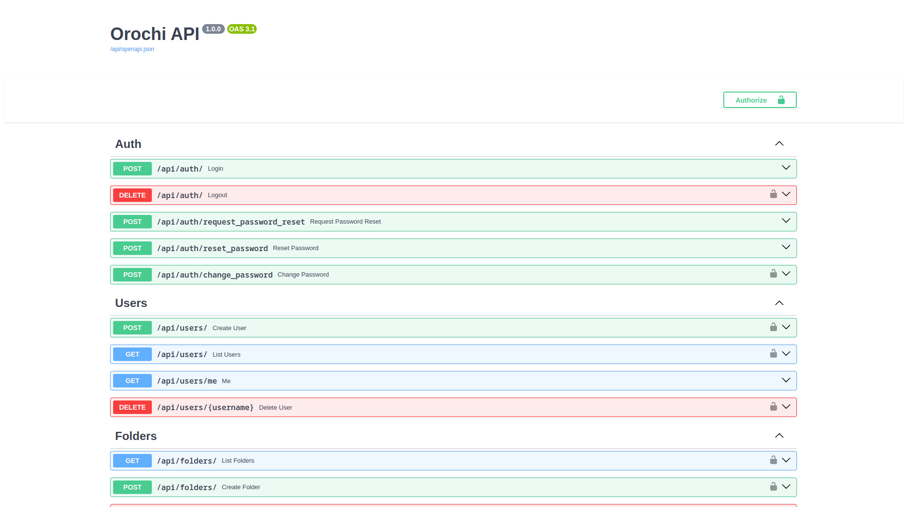

## Table of Contents

- [Table of Contents](#table-of-contents)
- [Concepts](#concepts)
- [Login](#login)
- [Swagger](#swagger)
- [ReDoc](#redoc)
- [Browsable API](#browsable-api)

## Concepts

The following libraries are used to implement API in Orochi: 

- Django REST framework: a powerful and flexible toolkit for building Web APIs.
- DRF - Yet another Swagger generator 2: Automated generation of real Swagger/OpenAPI 2.0 schemas from Django REST Framework code.
- drf-nested-routers: this package provides routers and fields to create nested resources in the Django Rest Framework. Nested resources are needed for full REST URL structure, if one resource lives inside another.

## Login

To have full access to API, first need login.
The GUI is available on port 8000, so if you are running dockers locally: http://127.0.0.1:8000

## Swagger

Swagger is a set of open-source tools built around the OpenAPI Specification that can help you design, build, document and consume REST APIs.
Swagger is available at http://127.0.0.1:8000/swagger/

## ReDoc

ReDoc is an open-source tool that generates API documentation from OpenAPI specifications. It’s one of the most powerful free docs tools in the industry, producing clean, customizable documentation with an attractive three-panel design.
ReDoc is available at http://127.0.0.1:8000/redoc/

## Browsable API

API may stand for Application Programming Interface, but humans have to be able to read the APIs, too; someone has to do the programming. Django REST Framework supports generating human-friendly HTML output for each resource when the HTML format is requested. These pages allow for easy browsing of resources, as well as forms for submitting data to the resources using POST, PUT, and DELETE.
Runserver and check product list and product detail endpoints. You should see similar pages.
Browsable API are available at http://127.0.0.1:8000/api/

