## Table of Contents

- [Table of Contents](#table-of-contents)
- [Concepts](#concepts)
- [Login](#login)
- [Accounts](#accounts)
    - [Email addresses](#email-addresses)
- [Users](#users)
- [Website](#website)
    - [Dumps](#dumps)
    - [Extracted dumps](#extracted-dumps)
    - [Plugins](#plugins)
    - [Results](#results)
    - [Services](#services)
    - [User plugins](#user-plugins)
- [Update Plugins](#update-plugins)
- [Update Symbols](#update-symbols)
- [Add Custom Plugins](#add-custom-plugins)
- [YARA](#yara)
    - [Update Rules](#update-rules)
    - [Generate Default Rule](#generate-default-rule)
    - [Manage Rules](#manage-rules)
    - [Manage Ruleset](#manage-ruleset)


## Concepts

With Orochi Admin you can customize default behavior of Volatility plugins, manage users, manage dumps and also enable additional services like ClamAV or VirusTotal.

## Login

A default superuser `admin` with password `admin` is automatically created. Change his password at first login.

Use the following docker-compose command to create additional superuser:
```
docker-compose run --rm django python manage.py createsuperuser
```
The admin page is available under /admin , so if you are running dockers locally: http://127.0.0.1:8000/admin


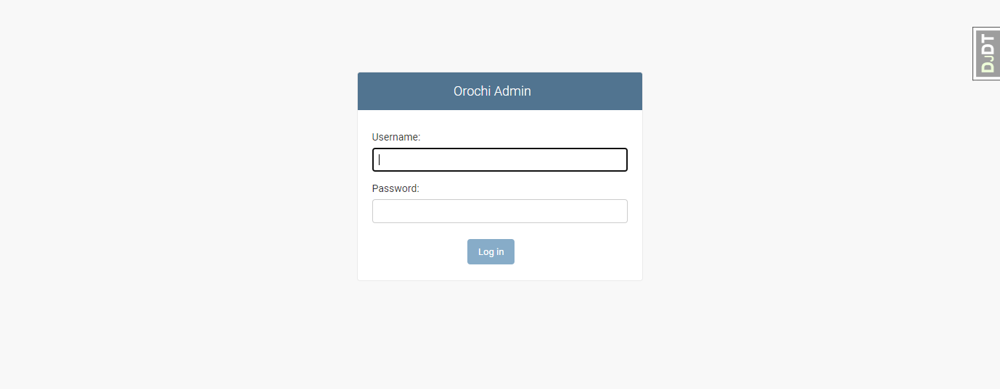


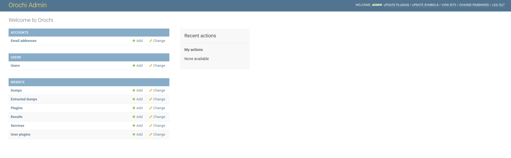

## Accounts
#### Email addresses

In this section Admin can check the status of users registration, if emails are verified or not. If needed the Admin can validate manually the email of the users.

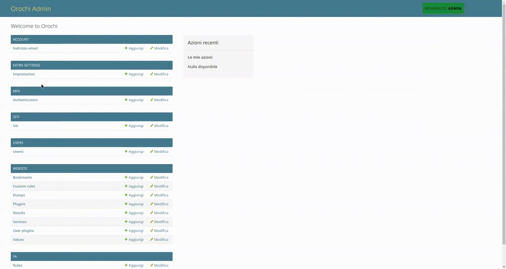


## Users

In this section Admin can view all registered users, edit users and delete users.


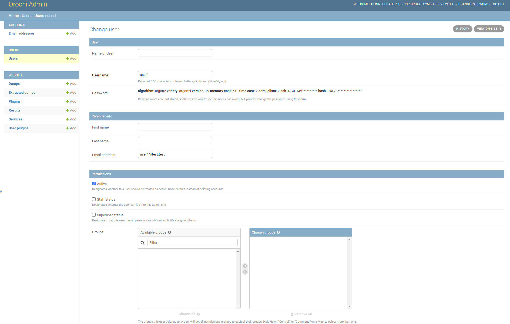


## Website

#### Dumps

In this section Admin can view all uploaded dumps of all users, edit dump info and delete dumps.

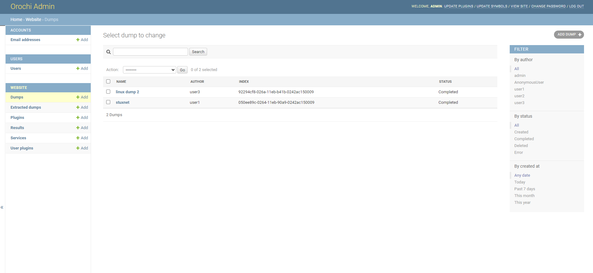
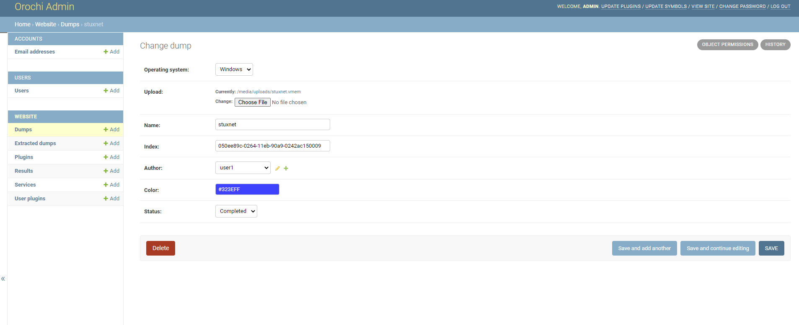


#### Extracted dumps

In this section Admin can view all files generated by Volatility plugins that have set the dump flag.
If needed Admin can delete files.

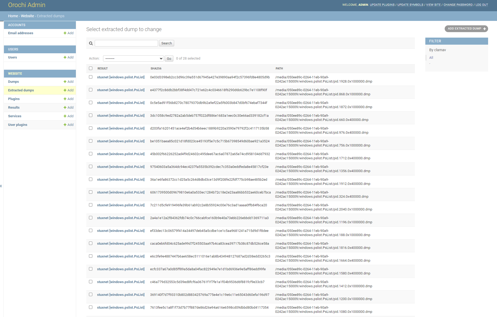
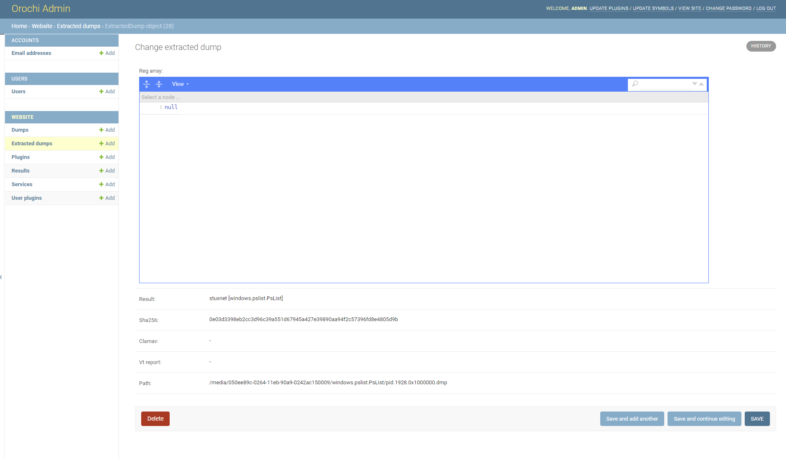

#### Plugins

In this section Admin can view all Volatility plugins and set global behavior of single plugins, for example enable ClamAV on all files generated by a plugin that supports dump flag (example windows.pslist)

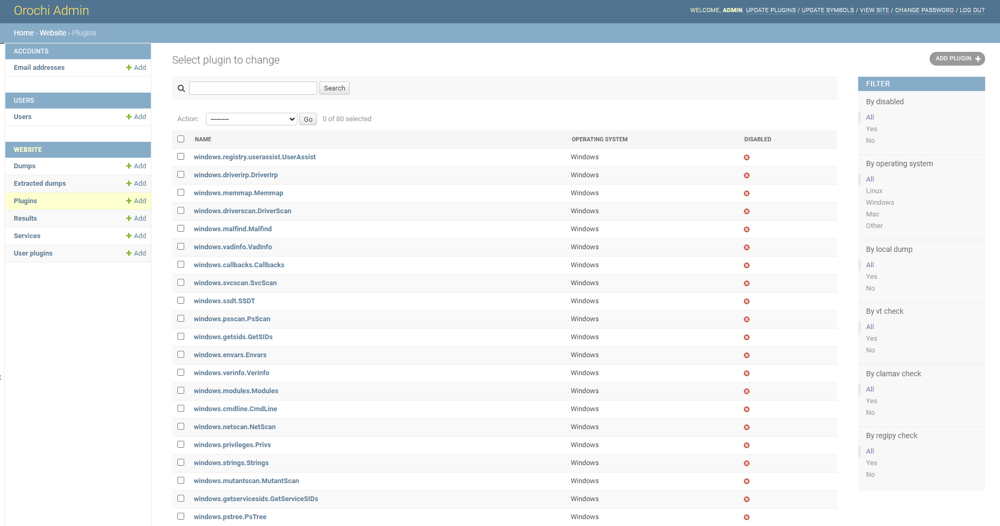
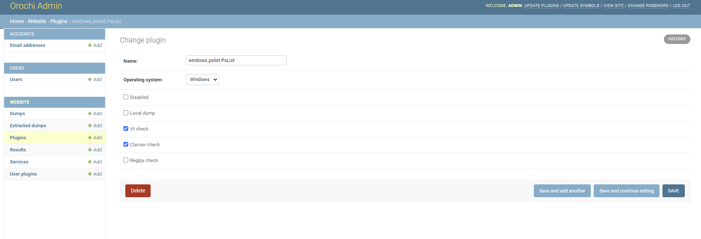

#### Results

In this section Admin can view the status of all Volatility plugins run on all dumps. Errors will be reported under Description section and under Parameter there is the json passed to plugin.

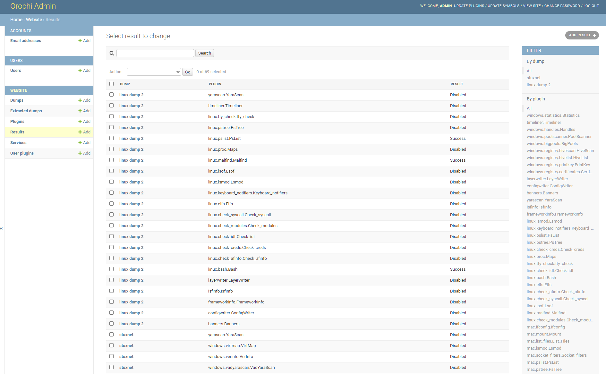
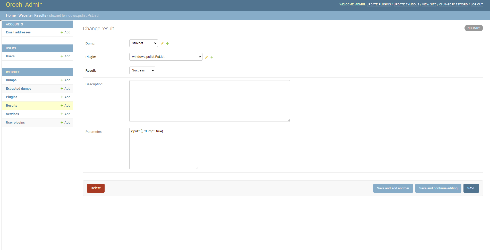

#### Services

In this section Admin can enable additional services. 
- Virustotal: when enabled in conjunction with dump flag on plugins that support it (example windows.pslist) it will query the sha256 of ALL dumped items against VirusTotal service and save the results. This means that if the dump of windows.plist generates 100 files, the service will do automatically 100 VirusTotal searches.
- MISP: users can export data directly to MISP. Here is possible to configure url and key of a MISP instance.

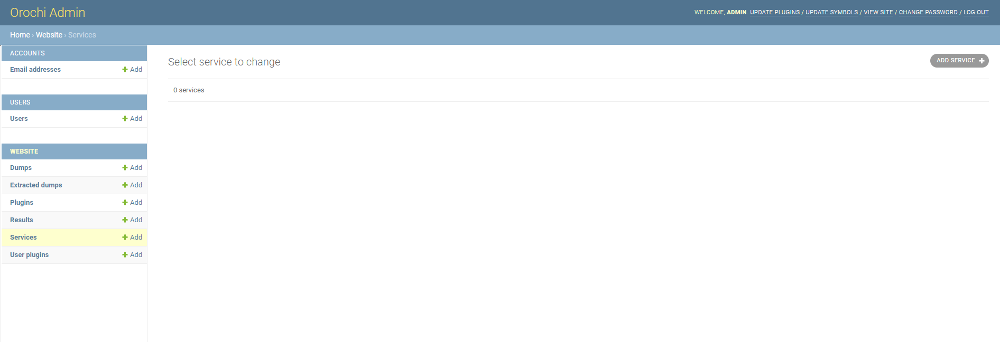
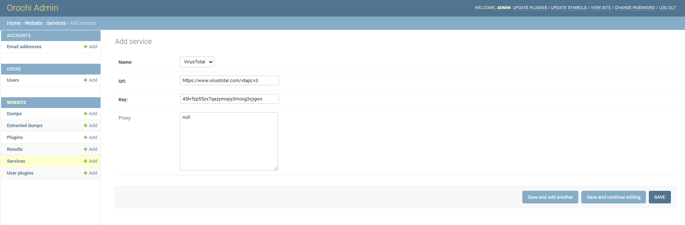

#### User plugins

In this section Admin can view all plugins of all users and change the default behavior: for example Admin can enable timeliner for user2 and in this case all dumps uploaded by user2 will run automatically timeliner

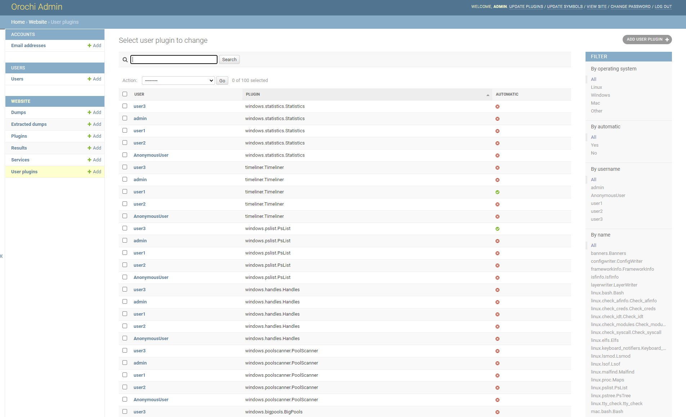
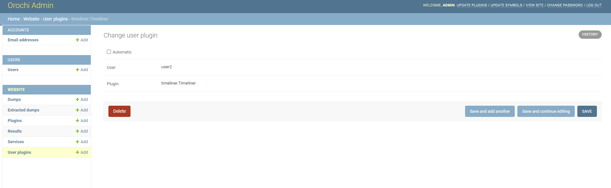


## Update Plugins
This function executes command
```docker-compose run --rm django python manage.py plugins_sync```
and will synchronize the framework with all plugins available with the installed Volatility version.

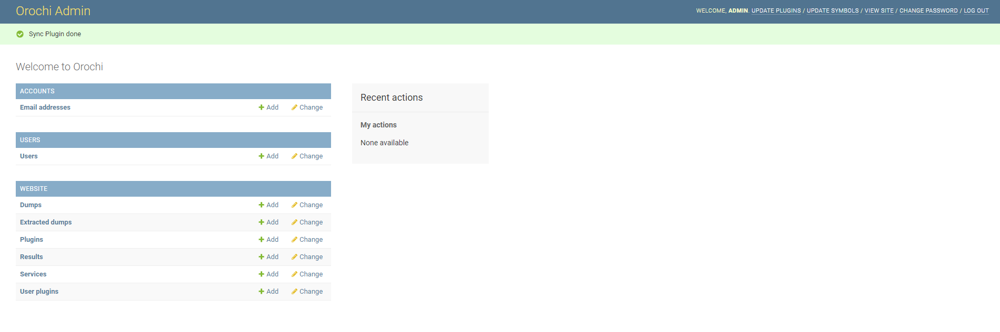

This is a typical log executing the update plugins command you will find in docker image of django:
```
django_1     | No plugins in db
django_1     | Available Plugins:
django_1     | Plugin windows.statistics.Statistics added!
django_1     | Plugin windows.statistics.Statistics added to AnonymousUser!
django_1     | Plugin windows.statistics.Statistics added to user2!
django_1     | Plugin windows.statistics.Statistics added to user1!
django_1     | Plugin windows.statistics.Statistics added to admin!
django_1     | Plugin timeliner.Timeliner added!
django_1     | Plugin timeliner.Timeliner added to AnonymousUser!
django_1     | Plugin timeliner.Timeliner added to user2!
django_1     | Plugin timeliner.Timeliner added to user1!
django_1     | Plugin timeliner.Timeliner added to admin!
django_1     | Plugin windows.pslist.PsList added!
django_1     | Plugin windows.pslist.PsList added to AnonymousUser!
django_1     | Plugin windows.pslist.PsList added to user2!
django_1     | Plugin windows.pslist.PsList added to user1!
django_1     | Plugin windows.pslist.PsList added to admin!
```

## Update Symbols
This function executes command
```docker-compose run --rm django python manage.py symbols_sync```
and will check if new symbols are available on Volatility website (checking the hash of files), in case affermative will download symbols and put in the right place.

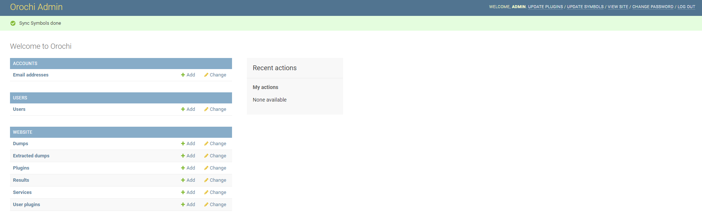

This is a typical log executing the update symbols command you will find in docker image of django:
```
django_1     | Local hash: None
django_1     | Remote hash: {'windows.zip': '7ae5225fa542d043af31fb3b9f5863de', 'mac.zip': '8b111c0ea5a1dd9309cf7e79ec2c6816', 'linux.zip': '029662b9e190e8d72b7b09da19015808'}
django_1     | Hashes for windows.zip are different - downloading
django_1     | Removing path /src/volatility/volatility/symbols/windows.
django_1     | Starting download of zip symbols windows.zip.
django_1     | Download of zip symbols completed for windows.zip.
django_1     | Hashes for mac.zip are different - downloading
django_1     | Removing path /src/volatility/volatility/symbols/mac.
django_1     | Starting download of zip symbols mac.zip.
django_1     | Download of zip symbols completed for mac.zip.
django_1     | Hashes for linux.zip are different - downloading
django_1     | Removing path /src/volatility/volatility/symbols/linux.
django_1     | Starting download of zip symbols linux.zip.
django_1     | Download of zip symbols completed for linux.zip.
django_1     | Updating local hashes
django_1     | Clearing cache
```


In case you will get the error 
```
requests.exceptions.ConnectionError: HTTPSConnectionPool(host='downloads.volatilityfoundation.org', port=443): Max retries exceeded with url: /volatility3/symbols/MD5SUMS (Caused by NewConnectionError('<urllib3.connection.HTTPSConnection object at 0x7fd47dbcedf0>: Failed to establish a new connection: [Errno -3] Temporary failure in name resolution'))
```
check 
```
/etc/docker/daemon.json
``` 
and add like 
```
{ "dns": ["8.8.8.8", "8.8.4.4"] } 
```

## Add Custom Plugins
Under plugins section is possible to add a custom plugin.

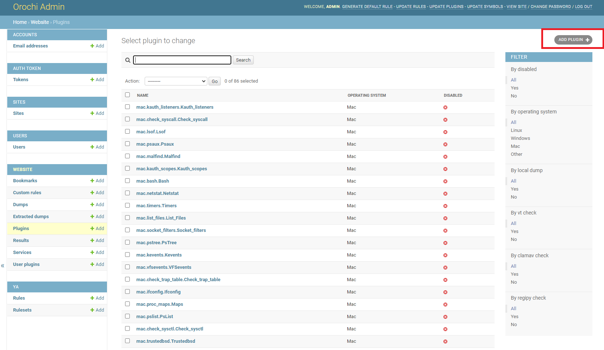

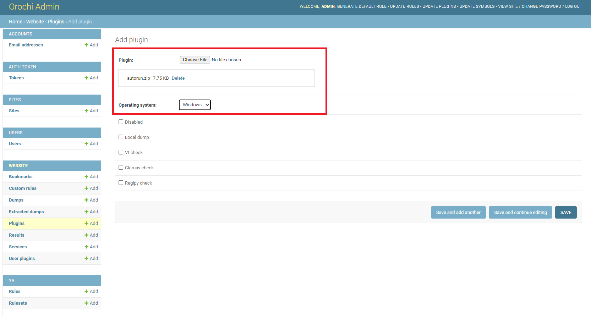

The supported format of uploaded file is only ZIP and MUST follow this schema:

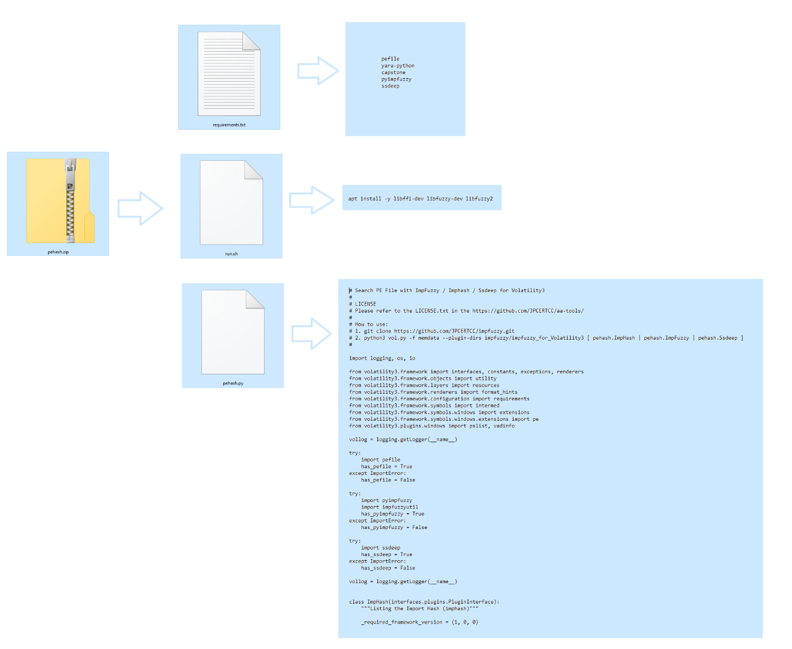

The minimum required file is the plugin itself: ```mycustomplugin.py``` for example https://github.com/Telindus-CSIRT/volatility3-autoruns

When the plugin requires additional libraries, for example https://github.com/JPCERTCC/impfuzzy/tree/master/impfuzzy_for_Volatility3 is possible to add in the ZIP file 2 additional files:
 - ```requirements.txt``` in case plugin needs some python library that needs to be installed with pip.
 - ```run.sh``` in case plugins needs some additional system library that needs to be instakked with apt.


The plugin is loaded and available to all system users like standard plugins:

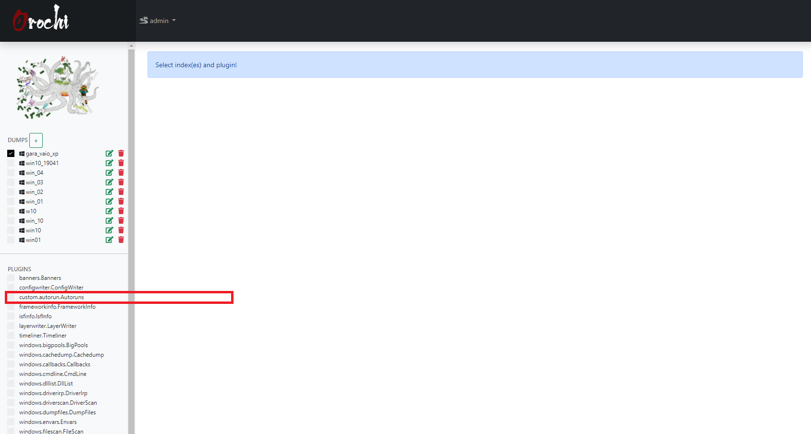


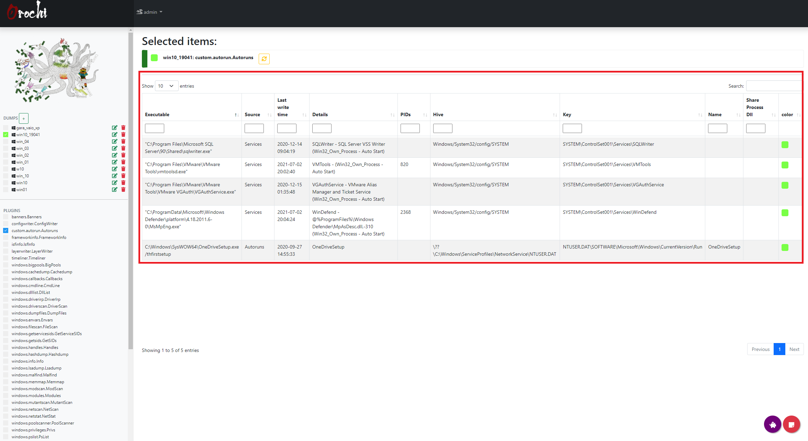


## YARA

Through the admin page is possible to manage the YARA rules that Volatility will use. 

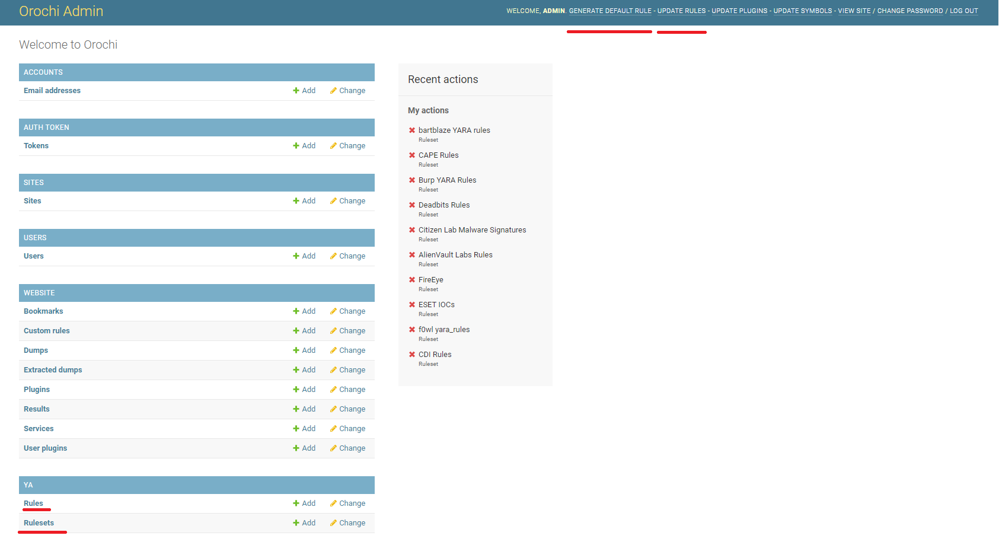


#### Update Rules

By press "Update Rules" Orochi will download all rules listed on Awesome YARA : https://github.com/InQuest/awesome-yara


#### Generate Default Rule

By press "Generate Default Rule" is possible to generate a set of YARA rules that users will be able to use as default. In this case Orochi will take and compile all rules enabled in rules section.


#### Manage Rules

In this section is possible to view all rules available in the system and enable/disable any rule.

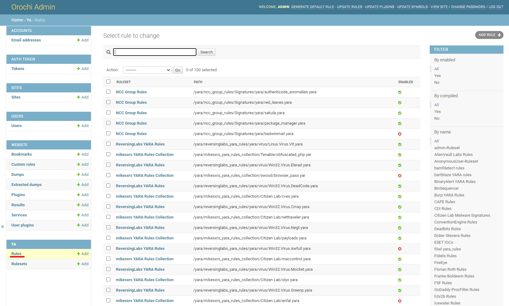


#### Manage Ruleset

In this section is possible to view all ruleset available in the system and enable/disable any ruleset.

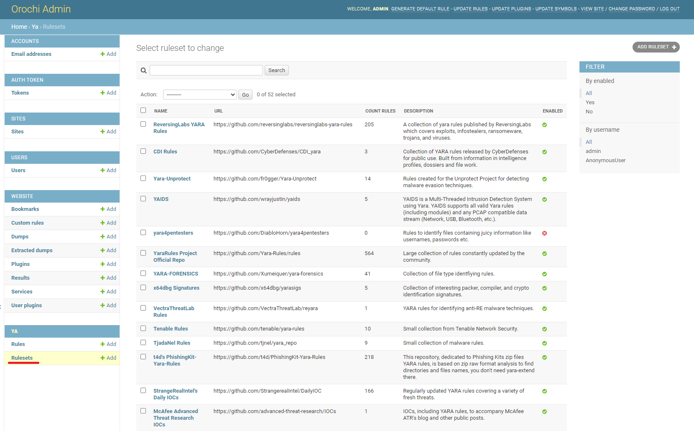

