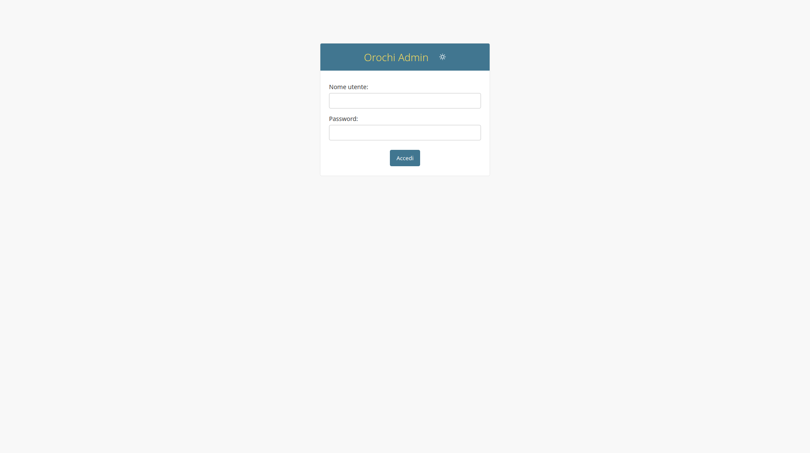

# Orochi Admin Guide

_Version 2.4.1 — October 2025_  
_Administrative Management and Maintenance Manual_

---

## Table of Contents

- [Quick Start](#quick-start)
- [Concepts](#concepts)
- [Login](#login)
- [Account Management](#account-management)
  - [Email Addresses](#email-addresses)
  - [Users](#users)
- [Website Management](#website-management)
  - [Dumps](#dumps)
  - [Extracted Dumps](#extracted-dumps)
  - [Plugins](#plugins)
  - [Results](#results)
  - [Services](#services)
  - [User Plugins](#user-plugins)
- [Updating and Maintenance](#updating-and-maintenance)
  - [Update Plugins](#update-plugins)
  - [Update Symbols](#update-symbols)
  - [Add Custom Plugins](#add-custom-plugins)
- [YARA Rules Management](#yara-rules-management)
  - [Update Rules](#update-rules)
  - [Generate Default Rule](#generate-default-rule)
  - [Manage Rules](#manage-rules)
  - [Manage Rulesets](#manage-rulesets)
- [Dask Monitoring](#dask-monitoring)
- [Version Information](#version-information)

---

## Quick Start

The **Orochi Admin Interface** allows administrators to:

- Manage users and permissions
- Configure and monitor Volatility plugins
- Enable services like **ClamAV**, **VirusTotal**, and **MISP**
- Maintain YARA rule sets and Dask worker nodes

### Default Access

- Default superuser: `admin`
- Default password: `admin`

⚠️ **Important:** Change the default password immediately after the first login.

To create additional superusers:

```bash
docker-compose run --rm django python manage.py createsuperuser
```

Then access the admin dashboard:

👉 [https://localhost/admin](https://localhost/admin)




---

## Concepts

The **Orochi Admin Interface** provides centralized management for the Volatility-based analysis environment.  
Through this panel, administrators can:

- Customize default plugin behavior
- Manage users, dumps, and extracted files
- Enable external integrations (VirusTotal, MISP, ClamAV)
- Maintain plugin and symbol databases
- Update and distribute YARA rulesets

---

## Login

Access the admin dashboard via Nginx at:

👉 [https://localhost/admin](https://localhost/admin)

Use the default credentials or your created superuser account.  
Once logged in, you’ll have full control over all administrative functions.

---

## Account Management

### Email Addresses

Monitor user registration and verification status here.  
Admins can manually validate users’ email addresses when needed.


### Users

View, edit, and remove registered users.  
You can modify permissions or reset passwords directly from this section.


---

## Website Management

This area lets administrators control all web-related data objects within Orochi, including dumps, plugins, and results.

### Dumps

View, edit, or delete all memory dumps uploaded by users.


### Extracted Dumps

Displays files created by Volatility plugins that use the **dump flag**.  
Administrators can delete files as needed.


### Plugins

View and configure all available Volatility plugins.  
Set global behaviors — for example, enabling **ClamAV** for all dumped files from a plugin such as `windows.pslist`.


### Results

Review the results of Volatility plugin executions.  
Errors are displayed under **Description**, and plugin parameters are visible under **Parameters**.


### Services

Enable and configure optional integrations.

- **VirusTotal:** Queries hashes (SHA-256) of dumped files automatically.  
  If a plugin generates 100 files, 100 VirusTotal queries will be performed automatically.
- **MISP:** Allows users to export findings directly to a configured MISP instance (API key and URL required).


### User Plugins

Admins can manage which plugins run automatically for specific users.  
For example, enabling **Timeliner** for user2 ensures it runs by default on all of their dumps.


---

## Updating and Maintenance

### Update Plugins

Synchronize the Orochi framework with all available Volatility plugins.

Run:

```bash
docker-compose run --rm django python manage.py plugins_sync
```


Example log output:

```
django_1 | No plugins in db
django_1 | Available Plugins:
django_1 | Plugin windows.statistics.Statistics added!
...
django_1 | Plugin windows.pslist.PsList added to admin!
```

💡 **Tip:** Use this after upgrading Volatility or adding new custom plugins.

---

### Update Symbols

Checks for and downloads new symbol files from the Volatility Foundation website.

Run:

```bash
docker-compose run --rm django python manage.py symbols_sync
```


Example log:

```
django_1 | Remote hash: {'windows.zip': '...', 'mac.zip': '...', 'linux.zip': '...'}
django_1 | Downloading updated symbol sets...
django_1 | Updating local hashes
```

⚠️ **Connection Error Tip:**  
If you encounter DNS issues such as:

```
requests.exceptions.ConnectionError: ... Failed to establish a new connection ...
```

Edit `/etc/docker/daemon.json` to include:

```json
{ "dns": ["8.8.8.8", "8.8.4.4"] }
```

---

### Add Custom Plugins

You can upload **custom Volatility plugins** directly from the admin panel.


#### Supported Format

Only **ZIP archives** are supported.  
A valid ZIP must include at least one `.py` plugin file following Volatility’s folder structure.

Example schema:


If additional dependencies are required, include:

- `requirements.txt` — Python libraries to install with pip
- `run.sh` — System-level dependencies to install via apt

After upload, the plugin becomes available to all users:


---

## YARA Rules Management

Administrators can fully manage YARA rule sets through the admin interface.


### Update Rules

Press **Update Rules** to download rule collections from  
[Awesome YARA](https://github.com/InQuest/awesome-yara).

### Generate Default Rule

Press **Generate Default Rule** to compile a base ruleset using all currently enabled rules.

### Manage Rules

View all system rules and enable or disable them as needed.


### Manage Rulesets

View and toggle entire YARA rulesets.


---

## Dask Monitoring

The **Dask Status Dashboard** is integrated into Orochi for real-time worker and task monitoring.

1. Click the **Admin** icon in the navigation bar.
2. Select **Dask Status**.
3. The Dask Bokeh dashboard opens, displaying worker activity, task progress, and resource utilization.


---

## Version Information

- **Application:** Orochi v2.4.1
- **Frameworks:** Django, Dask, Volatility 3
- **License:** MIT
- **Repository:** [https://github.com/LDO-CERT/orochi](https://github.com/LDO-CERT/orochi)

---

© 2025 LDO-CERT — Administrative Management Manual
