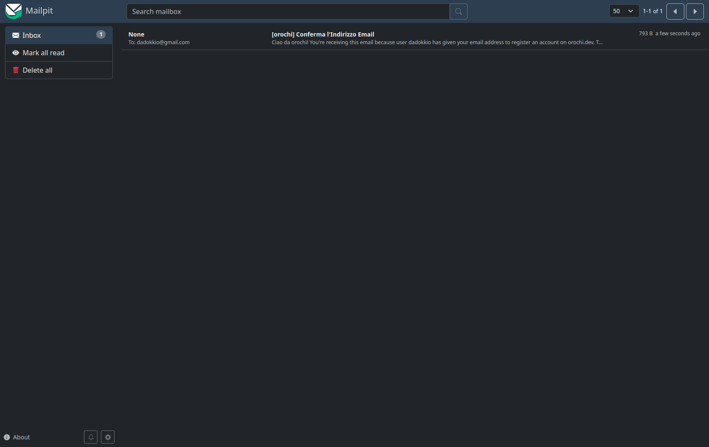
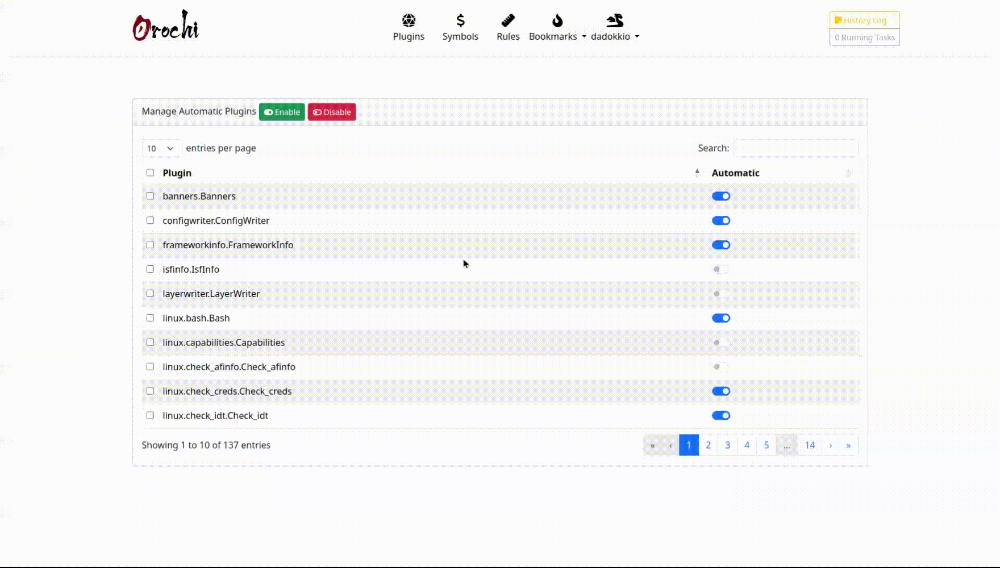
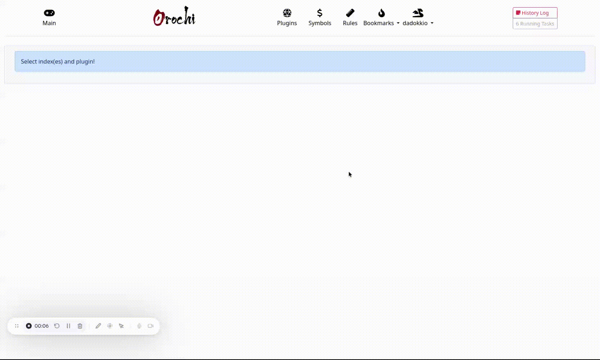
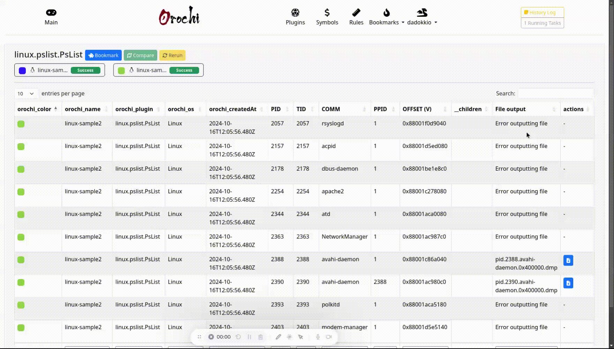
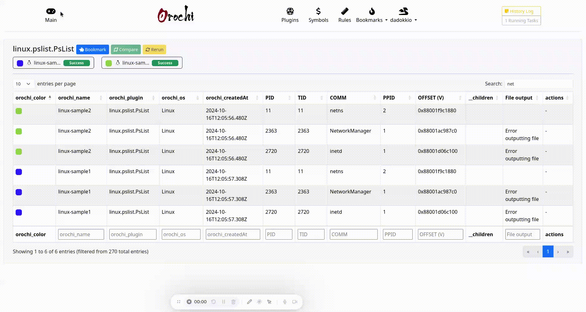
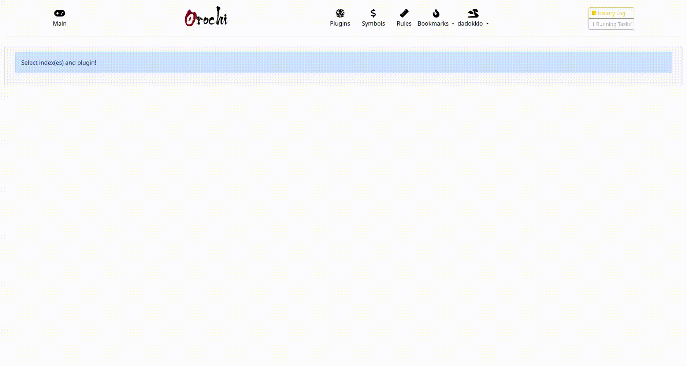

# Orochi User Guide

_Version 2.4.1 — October 2025_  
_Collaborative Memory Forensics and Threat Intelligence Platform_

---

## Table of Contents

- [Quick Start](#quick-start)
- [Concepts](#concepts)
- [Login](#login)
- [Plugins](#plugins)
- [Upload Dump](#upload-dump)
- [Executing Plugins](#executing-plugins)
- [Task Monitoring (Dask)](#task-monitoring-dask)
- [Searching](#searching)
- [Comparing Plugin Results](#comparing-plugin-results)
- [Sharing Dumps](#sharing-dumps)
- [Bookmarks](#bookmarks)
- [Export to MISP](#export-to-misp)
- [Deleting Dumps](#deleting-dumps)
- [YARA](#yara)
- [HEX Viewer](#hex-viewer)

---

## Quick Start

Get up and running with Orochi in minutes.

1. Start the stack:
   ```bash
   docker-compose up -d
   ```
2. Access the interface at [https://localhost](https://localhost)
3. Register a new account via the **Sign Up** page.
4. Confirm your email using **Mailpit** (`http://localhost:8025`).
5. Upload your first memory dump.
6. Run Volatility plugins and view results.
7. (Optional) Export findings to **MISP**.

💡 **Tip:** Use a color label when uploading dumps — it helps distinguish results when comparing multiple memory images.

---

## Concepts

Orochi is an open-source, collaborative GUI built on **Django** for the **Volatility 3** memory forensics framework.  
It enables distributed, high-speed analysis of memory dumps and team-based investigation workflows.

### Architecture Overview

- **Django (WSGI)** – Handles regular web requests and REST APIs.
- **Django (ASGI)** – Manages real-time WebSocket notifications and updates.
- **Dask** – Distributes workload across multiple worker nodes for concurrent plugin execution.
- **Nginx** – Serves as the reverse proxy and HTTPS frontend.

Orochi combines these components to offer a scalable and responsive analysis environment.

---

## Login

Access the Orochi GUI via Nginx. If you’re running Docker locally, open:

👉 [https://localhost](https://localhost)

1. Go to the **Sign Up** page to create a new user.
2. Confirm your email via **Mailpit** (`http://localhost:8025`).
3. Log in with your new credentials.




> 🧩 **Troubleshooting:** If you don’t receive the confirmation email, open Mailpit directly and check the inbox.

---

## Plugins

Plugins are Volatility 3 modules that Orochi executes to extract forensic artifacts such as process lists, DLLs, and network connections.

Each user can select which plugins run automatically after uploading a dump.  
If none are selected, plugins can be executed manually later.



> ⚙️ **Note:** Orochi supports both built-in and custom Volatility plugins added by administrators.

---

## Upload Dump

To upload a memory dump:

1. Click the **➕** button near **DUMPS**.
2. Choose your file and set the name and operating system.
3. (Optional) Select a **color label** to distinguish multiple dumps.
4. Wait for the upload to finish, then click **Create Index**.



### Supported Formats

- Raw (`.raw`, `.mem`) and zipped (`.zip`) dumps
- Password-protected ZIP files
- VMware snapshots (`.vmem` + `.vmss`) in a single ZIP

Large memory dumps can also be placed manually in `/media/uploads` and selected via the **Local folder** dropdown or a management command.


After upload, press the **ℹ️** icon near the dump name to view details such as hash values, file size, and storage path.


---

## Executing Plugins

After selecting a dump, a list of available plugins is displayed.

You can:

- ✅ View results for auto-executed plugins.
- ▶️ Run a plugin manually.
- 🔁 Re-run a plugin with custom parameters (e.g., `--dump` or `--strings`).

WebSocket notifications provide real-time updates on plugin execution status.


If a plugin fails, an error log icon will appear.


### Task Monitoring (Dask)

Plugins run concurrently across **Dask workers** for fast parallel processing.  
By default, the Docker Compose setup creates two workers locally. For production, connect remote workers to the same Dask scheduler.

To monitor tasks:

1. Click the **Admin** icon in the navigation bar.
2. Select **Dask Status** from the dropdown.


> 💡 **Tip:** Use the dashboard to monitor job progress and worker performance.

---

## Searching

Perform full-text searches through plugin results using the integrated DataTable view.  
Search works across multiple dumps if more than one is selected.



> 🔍 **Tip:** Use this to correlate artifacts across different memory captures.

---

## Comparing Plugin Results

When two dumps are selected, choose a common plugin to compare their results side by side.  
Colors help identify results per dump, and a JSON diff highlights differences.


---

## Sharing Dumps

You can share dumps and their results between users.

- The uploader becomes the **owner**.
- Shared users can:
  - View dumps and plugin results
  - Run or re-run plugins
  - ❌ Cannot delete dumps

| Action      | Owner | Shared User |
| ----------- | ----- | ----------- |
| View dump   | ✅    | ✅          |
| Run plugin  | ✅    | ✅          |
| Delete dump | ✅    | ❌          |


> 🤝 **Collaboration Tip:** Shared dumps enable multi-user investigation on the same evidence set.

---

## Bookmarks

Bookmarks let you quickly return to specific filtered results.

1. While viewing a result, click the **Bookmark** icon.
2. Assign a name, choose an icon (from [MTG](https://magic.wizards.com/) sets), and optionally star it for quick access.


Starred bookmarks appear in the quick-access menu. Non-starred ones are accessible under **Bookmarks** in the admin panel.

> 💡 **Tip:** Bookmarks can reference queries across multiple dumps.

---

## Export to MISP

Orochi integrates with **MISP** for exporting forensic data as structured intelligence.  
You can export single items directly.


### Result in MISP

Exported files and AV signatures appear as related MISP objects.


> 🔗 **Note:** Ensure MISP API credentials are configured before exporting.

---

## Deleting Dumps

Deleting a dump removes it and all associated plugin results permanently.



> ⚠️ **Warning:** This action cannot be undone.

---

## YARA

Orochi provides a dedicated interface for managing YARA rules used by Volatility plugins.


You can:

- View rules imported and enabled by the admin.
- Perform full-text search through PostgreSQL integration.
- Build compiled YARA files for Volatility.
- Choose whether compiled files are **private** or **public**.


### Example Workflow

1. Search for rules containing “credential”.
2. Select relevant ones.
3. Build a compiled YARA file.
4. Run the Volatility `yara` plugin using that file.


> 🧠 **Tip:** Only the compiled file marked _default_ is used by the Volatility YARA plugin.

---

## HEX Viewer

Orochi includes a remote HEX viewer for browsing dumps directly in the browser.



You can:

- Browse through offsets.
- Jump to a specific address.
- Search for ASCII or hexadecimal values.
- View both hex and ASCII representations.

> ⚡ **Performance Tip:** Large dumps may take several seconds to load depending on size and system resources.

---

## Version Information

- **Application:** Orochi v2.4.1
- **Frameworks:** Django, Dask, Volatility 3
- **License:** MIT
- **Repository:** [https://github.com/LDO-CERT/orochi](https://github.com/LDO-CERT/orochi)

---

© 2025 LDO-CERT — Collaborative Memory Forensics Platform
