# Orochi User Guide

_Version 2.5.0 — 2026_  
_Collaborative Memory Forensics and Threat Intelligence Platform_

---

## Table of Contents

- [Quick Start](#quick-start)
- [Concepts](#concepts)
- [UI and Theming](#ui-and-theming)
- [Login](#login)
- [Plugins](#plugins)
- [Symbols Management](#symbols-management)
- [Upload Dump & Folder Organization](#upload-dump--folder-organization)
- [Executing Plugins](#executing-plugins)
- [Activity Drawer and Task Management](#activity-drawer-and-task-management)
- [Searching and Exporting Data](#searching-and-exporting-data)
- [Cross-Dump Global Search](#cross-dump-global-search)
- [Comparing Plugin Results](#comparing-plugin-results)
- [Sharing Dumps](#sharing-dumps)
- [Bookmarks](#bookmarks)
- [Cases & Investigation Management](#cases--investigation-management)
- [Export to MISP](#export-to-misp)
- [Deleting Dumps](#deleting-dumps)
- [YARA](#yara)
- [HEX Viewer](#hex-viewer)
- [Interactive JSON Viewer](#interactive-json-viewer)
- [Version Information](#version-information)


---

## Quick Start

Get up and running with Orochi in minutes.

1. Start the stack:
   ```bash
   docker-compose up -d
   ```
2. Access the interface at [https://localhost](https://localhost)
3. Register a new account via the **Sign Up** page.
4. Confirm your email using **Mailpit** (`http://localhost:8025`).
5. Upload your first memory dump.
6. Run Volatility plugins and view results.
7. (Optional) Export findings to **MISP**.

💡 **Tip:** Use a color label when uploading dumps — it helps distinguish results when comparing multiple memory images.

---

## Concepts

Orochi is an open-source, collaborative GUI built on **Django** for the **Volatility 3** memory forensics framework.  
It enables distributed, high-speed analysis of memory dumps and team-based investigation workflows.

### Architecture Overview

- **Django (WSGI)** – Handles regular web requests and REST APIs.
- **Django (ASGI)** – Manages real-time WebSocket notifications and updates.
- **Dask** – Distributes workload across multiple worker nodes for concurrent plugin execution.
- **Nginx** – Serves as the reverse proxy and HTTPS frontend.

Orochi combines these components to offer a scalable and responsive analysis environment.

---

## UI and Theming

Orochi provides a modern, responsive interface powered by Tailwind CSS. You can easily toggle between Light and Dark mode using the dropdown menu in the top navigation bar. The interface utilizes HTMX for seamless, dynamic updates without full page reloads, making navigating large memory dumps fast and efficient.

## Login

Access the Orochi GUI via Nginx. If you’re running Docker locally, open:

👉 [https://localhost](https://localhost)

1. Go to the **Sign Up** page to create a new user.
2. Confirm your email via **Mailpit** (`http://localhost:8025`).
3. Log in with your new credentials.

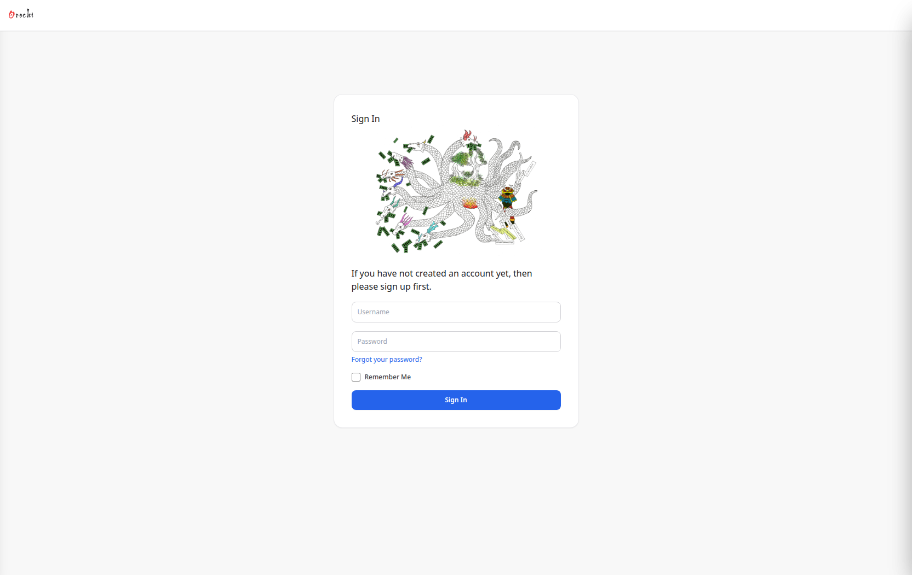
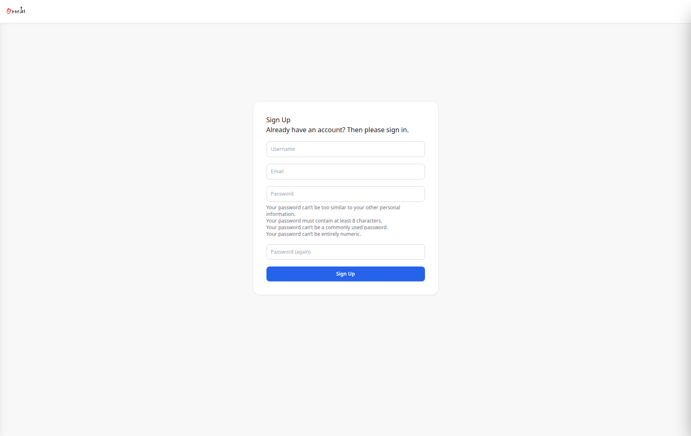
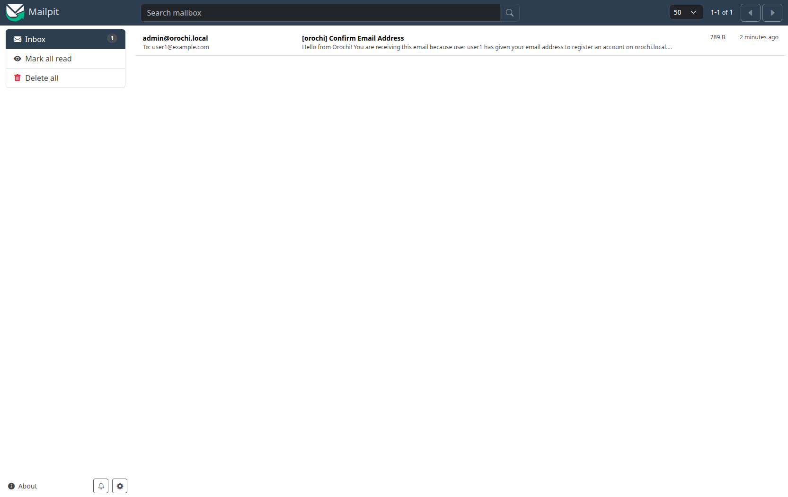

> 🧩 **Troubleshooting:** If you don’t receive the confirmation email, open Mailpit directly and check the inbox.

---

## Plugins

Plugins are Volatility 3 modules that Orochi executes to extract forensic artifacts such as process lists, DLLs, and network connections.

Each user can select which plugins run automatically after uploading a dump.  
If none are selected, plugins can be executed manually later.

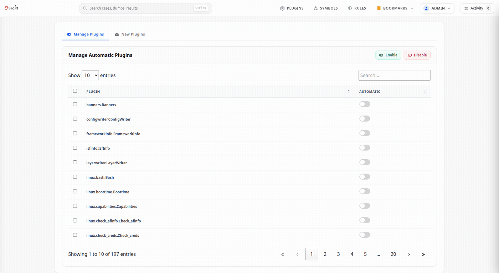

> ⚙️ **Note:** Orochi supports both built-in and custom Volatility plugins added by administrators.

---

## Symbols Management

Orochi features a centralized Symbols management interface accessible via the **Symbols** link in the top navigation bar (`/list_symbols`).

Operating system debugging symbols and Intermediate Symbol Format (ISF) tables are essential for Volatility 3 to analyze Windows, Linux, and macOS kernels accurately.

From the Symbols Hub, you can:
- **Inspect Available Symbol Tables**: Browse active and cached symbol tables across Windows, Linux, and macOS.
- **Upload Custom Symbols**: Upload custom `.json` or `.json.xz` symbol files generated from specific kernels or builds.
- **Upload Symbol Packages**: Upload archive packages containing symbol collections directly to the Volatility symbols repository.
- **Download from ISF Servers**: Automatically fetch and unpack pre-built ISF symbol tables directly from remote repositories.

---

## Upload Dump & Folder Organization

To upload a memory dump:

1. Click the **➕** button near **DUMPS**.
2. Choose your file, set the name, and select the target operating system.
3. (Optional) Assign a **Folder** and a distinct **color label** to organize and differentiate multiple dumps.
4. Wait for the upload to complete, then click **Create Index**.

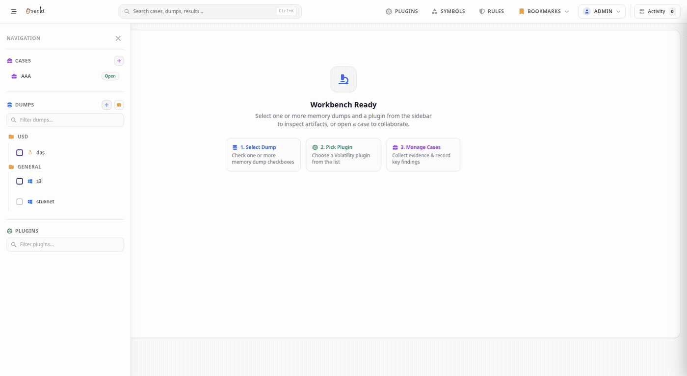

### Folder Organization & Autocomplete

Orochi allows you to organize multiple memory dumps into collapsible folders in the sidebar:

- **Smart Autocomplete**: Clicking or focusing the **Folder** input presents a list of all existing folders, each showing a folder icon and the number of existing dumps inside it.
- **On-the-Fly Folder Creation**: Typing a name that does not yet exist shows an interactive **Create folder "<name>"** action in the dropdown. Clicking it immediately registers the folder in the database.
- **Pre-Creation Safety Net**: Even if you submit the form without clicking the dropdown suggestion, Orochi automatically verifies and creates the new folder before saving the dump.

### Supported Formats

- Raw (`.raw`, `.mem`) and zipped (`.zip`) dumps
- Password-protected ZIP archives
- VMware snapshots (`.vmem` + `.vmss`) in a single ZIP

Large memory dumps can also be placed manually in `/media/uploads` and selected via the **Local folder** dropdown or via the API.

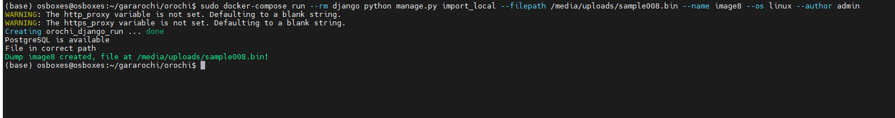

After upload, press the **ℹ️** icon near the dump name to view details such as SHA-256 hash values, file size, and storage path.

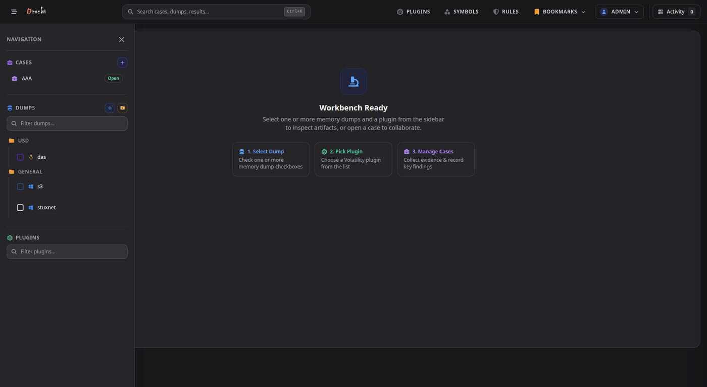

---

## Executing Plugins

After selecting one or more dumps, the list of available Volatility plugins is displayed.

You can:

- ✅ View results for auto-executed plugins.
- ▶️ Run a plugin manually by clicking on it.
- 🔁 Re-run a plugin with custom parameters (e.g., `--dump`, `--pid`, or `--strings`).

WebSocket notifications provide real-time updates on plugin execution status.

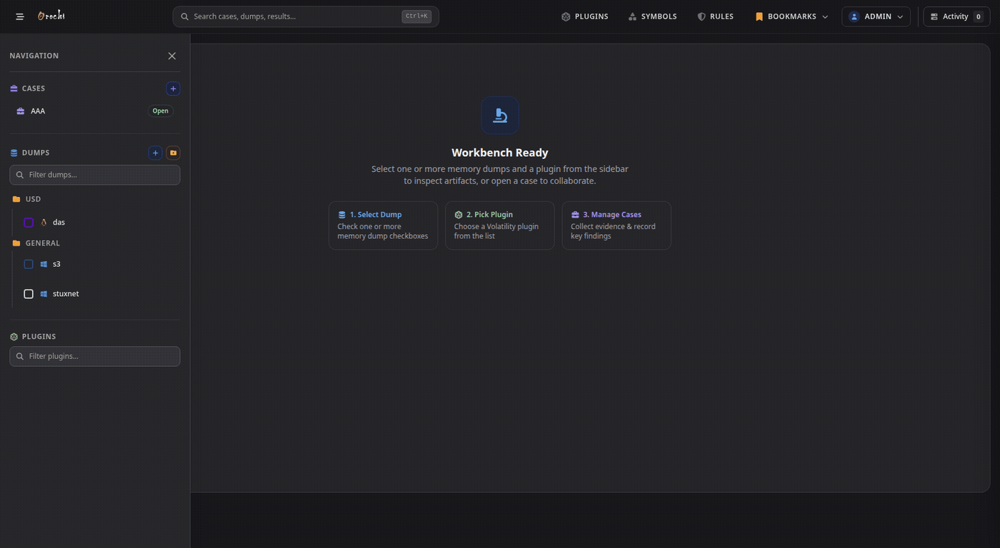
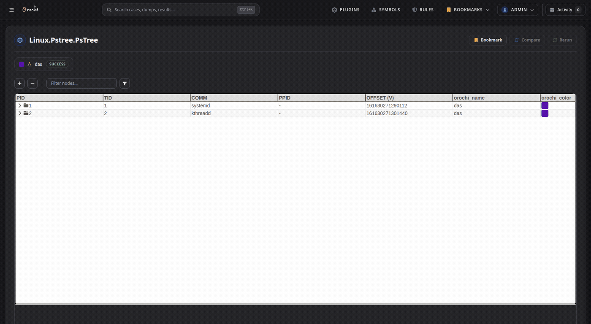

If a plugin encounters an error, a red error log badge appears with one-click access to the full Volatility traceback.

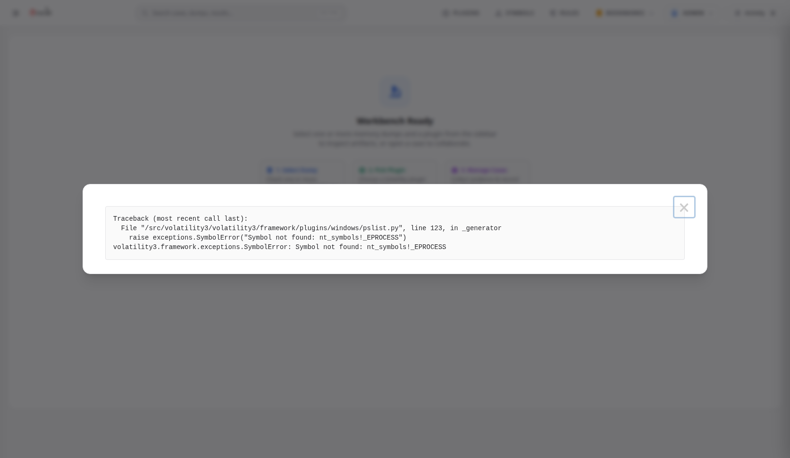

### MaxMind GeoIP & ASN Resolution
When viewing results from network forensic plugins (such as `windows.netscan.NetScan`, `windows.netstat.NetStat`, and `linux.sockstat.Sockstat`), external IP address columns (`ForeignAddr`, `Destination Addr`) display an interactive map pin button:

```html
<a class="... maxmind-info" data-ip="..."><i class="fa-solid fa-map-location"></i></a>
```

Clicking the button queries Orochi's integrated MaxMind GeoLite2 engine to display the registered Autonomous System Number (ASN), ISP organization, city, country, and geographical coordinates in a popup modal.

> 📖 **Configuration:** To configure or update GeoIP databases, see the [Services and MaxMind Configuration Guide](Services-and-MaxMind-Guide.md).

---

## Activity Drawer and Task Management

Orochi features a unified **Activity Drawer** accessible from the top navigation bar, combining real-time background task monitoring with notification history.

The top navigation bar displays a live indicator:
- **Running Task Counter**: Live count of active jobs across the cluster.
- **Queued Badge**: Indicates pending jobs awaiting worker availability.
- **Animated Spinner**: Visually highlights active forensic tasks in progress.

Clicking the **Activity** button opens a 38rem slide-out drawer with two tabs:

### 1. Worker & Dask Tasks Tab

- **Live Dask Task Feed**: Tracks all operations running on Dask workers:
  - Archive extraction (`unzip`)
  - Dump ingestion & hash computation (`manage_upload`)
  - Volatility plugin analysis (`run_plugin`)
  - Maintenance & caching tasks (`TaskLog`)
- **Task Details Inspection**: Click the info icon (`ℹ️`) on any active task to inspect execution runtime duration, assigned worker node, dump OS/index metadata, plugin parameters, and live logs in a formatted inspection modal.
- **Kill / Cancel Task**: Users can safely cancel their own running tasks (and superusers can cancel any task) by clicking the cancel icon (`🚫`). Orochi aborts the Dask future immediately and marks the database status as cancelled, releasing worker threads.
- **Connected Workers**: View worker hostnames, CPU thread capacity, memory utilization, and busy/idle states.
- **Task History & Rerun**: Review recent background operations and click **Rerun** to re-submit failed tasks directly.

### 2. History Log Tab

- A persistent real-time event feed powered by WebSockets.
- Logs dump creations, plugin finishes, error notifications, and system events.
- Unread notification badges automatically dismiss when opening the drawer.

---

## Searching and Exporting Data

Orochi provides a modernized DataTables interface wrapped in a clean, elevated card container for analyzing extracted forensic artifacts.

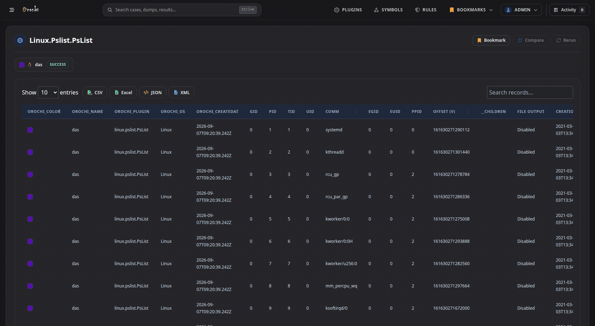

### Full-Text & Column Filtering
- **Global Search**: Instant full-text search across all extracted columns with modern focus-ring inputs and live filtering.
- **Column Footers**: Dedicated per-column filter inputs (`Filter <column>...`) in the table footer allow surgical filtering by specific attributes (e.g. PID, Process Name, IP Address).

### Multi-Format Data Export
Export filtered forensic evidence directly from the toolbar:
- **CSV**: Download clean comma-separated values for custom scripting.
- **Excel**: Export formatted spreadsheets for stakeholder reporting.
- **JSON**: Export complete JSON structures for ingestion into external threat intelligence tools.
- **XML**: Export structured XML documents.

### Unmistakable Dump Selection Recognition
When analyzing multiple memory dumps side by side, Orochi makes active selections unmistakable:
- **Color Accent Border**: Active dumps display a bold 4px left border dynamically colored with the dump's assigned color (`var(--dump-color)`).
- **Soft Tinted Row**: Selected dumps feature a subtle background tint in both light and dark modes.
- **Bold Titles & Checkmarks**: High-contrast typography and clear checkbox indicators show at a glance which memory images are included in the current analysis view.


> 🔍 **Tip:** Use this to correlate artifacts across different memory captures.

---

## Cross-Dump Global Search

In addition to filtering within individual plugin tables, Orochi provides a high-performance **Cross-Dump Global Search** powered by PostgreSQL full-text search.

The global search input is prominently located in the top navigation bar and accessible across all views.

Key capabilities:
- **Simultaneous Multi-Dump Querying**: Search across all memory dumps you have access to with a single query, matching process names, command lines, IP addresses, hashes, or arbitrary memory strings.
- **Ranked Match Results**: Results are returned grouped by dump and plugin, highlighted by relevance ranking.
- **Direct Investigation Linkage**: Each search result row includes an **Add to Case** button, allowing investigators to instantly attach relevant forensic hits as evidence directly into an active investigation case.

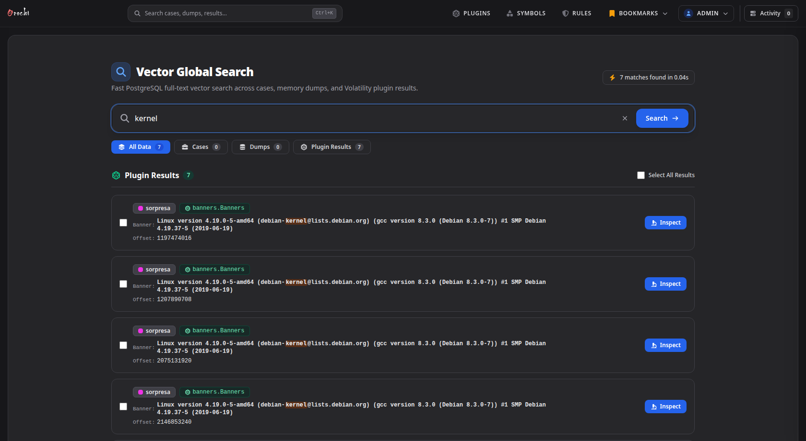

---

## Comparing Plugin Results & Temporal Diff

### 1. Single Plugin JSON Diff (Compare-2-Results)
When two dumps are selected, choose a common plugin to compare their results side by side.  
Colors help identify results per dump, and a JSON diff highlights differences.

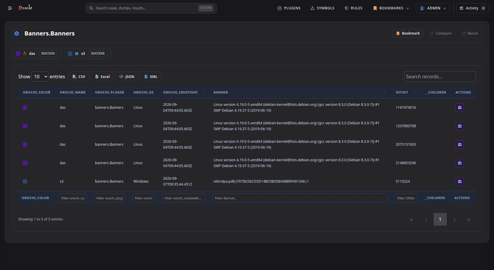

### 2. Temporal Diff — Same Host T1 vs T2
For timeline and delta analysis of the same machine captured at two points in time (or any two selected captures):

- **Chronological Baseline Ordering**: Orochi automatically orders dumps into **T1** (earlier baseline capture) and **T2** (later capture), displaying the elapsed delta time (e.g. `Δ Time: +2h 15m`). You can also click **Swap T1 / T2** to invert the reference perspective.
- **Processes Delta**:
  - **`+ NEW in T2`**: Processes spawned after baseline capture T1 (highlighted in emerald green).
  - **`- Terminated`**: Processes that were running in T1 but terminated before T2 (highlighted in rose).
  - **`Persisted`**: Long-running background processes active across both captures.
- **Injected Memory Regions (Malfind)**:
  - Surfaces code injection, shellcode, and hollowed binaries discovered in T2 that were absent in T1.
  - Automatically flags PE (`MZ`) and ELF executables hidden in dynamic memory.
- **Network Connections Delta**:
  - Highlights new outbound and inbound sockets active in T2.
  - One-click MaxMind GeoIP integration for foreign IP addresses.
- **All Plugins Diff (Compare-2-Results Integration)**:
  - Lists all common plugins executed across both captures, indicating whether deltas were detected, with direct access to full side-by-side JSON diffs.

You can launch Temporal Diff directly by clicking the **Temporal Diff** button in the analysis toolbar whenever two dumps are active, or via the notification banner when checking two dumps in the workbench.

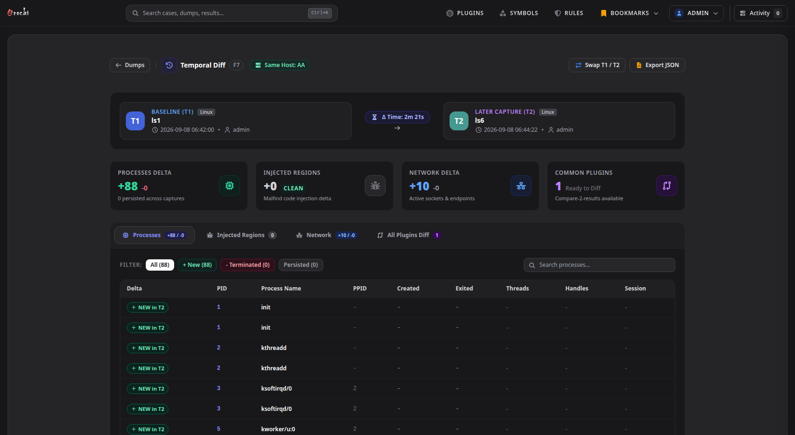

---

## Sharing Dumps

You can share dumps and their results between users.

- The uploader becomes the **owner**.
- Shared users can:
  - View dumps and plugin results
  - Run or re-run plugins
  - ❌ Cannot delete dumps

| Action      | Owner | Shared User |
| ----------- | ----- | ----------- |
| View dump   | ✅    | ✅          |
| Run plugin  | ✅    | ✅          |
| Delete dump | ✅    | ❌          |

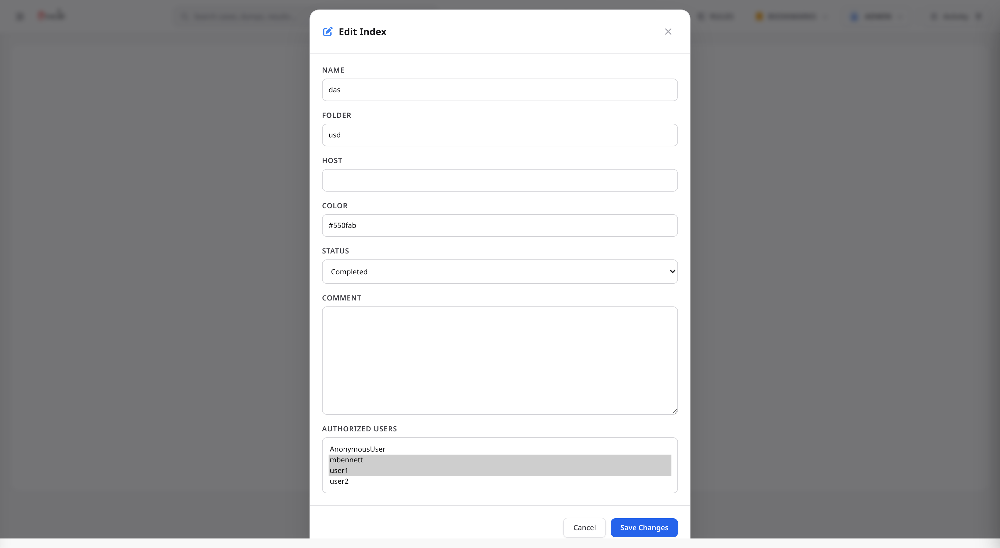

> 🤝 **Collaboration Tip:** Shared dumps enable multi-user investigation on the same evidence set.

---

## Bookmarks

Bookmarks let you quickly return to specific filtered results.

1. While viewing a result, click the **Bookmark** icon.
2. Assign a name, choose an icon (from [MTG](https://magic.wizards.com/) sets), and optionally star it for quick access.

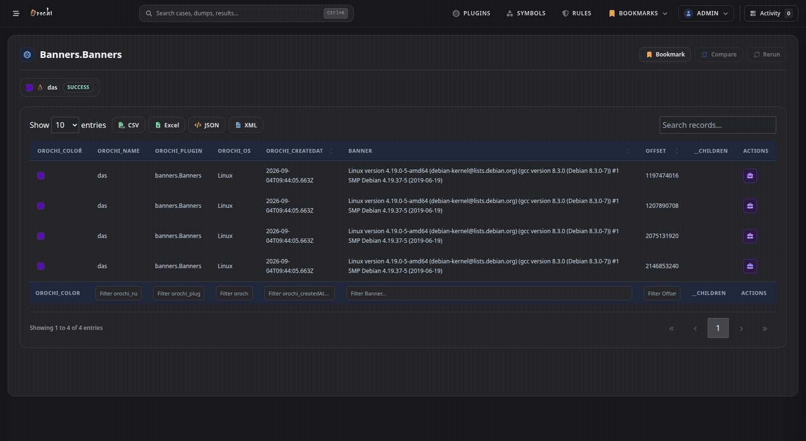

Starred bookmarks appear in the quick-access menu. Non-starred ones are accessible under **Bookmarks** in the admin panel.

> 💡 **Tip:** Bookmarks can reference queries across multiple dumps.

---

## Cases & Investigation Management

Orochi transforms memory forensics from isolated analysis into a structured incident response workflow through its built-in **Cases** management system.

Located in the left sidebar under the **Cases** header, this suite enables DFIR analysts to group evidence, document attacker activity, map findings to MITRE ATT&CK techniques, and export executive-ready incident reports.

### Creating and Managing Cases
- **Case Workspaces**: Create an investigation case by clicking the **➕** button next to **Cases**. Assign a name, folder, description, and status (**Open**, **In Progress**, **Closed**).
- **Status Management & Quick Actions**: Change status seamlessly at any time via the interactive status badge dropdown (Open, In Progress, Closed) or click the **Close Case** / **Reopen Case** action button directly in the case header.
- **CTF Mode**: Toggle the **CTF** flag for training or capture-the-flag competitions, enabling streamlined scoring and objective tracking.
- **Collaboration**: Add team members as collaborators in the case modal. Collaborators can concurrently view, edit, attach evidence, and document findings on shared cases, with visual collaborator indicators in the sidebar and header.

### Evidence & Artifact Collection
Investigators can collect and attach forensic evidence to a case from multiple sources:
- **Memory Dumps**: Associate entire memory dumps to the case context.
- **Extracted Files**: Attach dumped executables, injected DLLs, or unpacked payloads.
- **Plugin Result Rows**: Directly link suspicious process entries, network connections, or injected memory sections as individual evidence items.

### Findings & MITRE ATT&CK Mapping
For each piece of evidence, analysts can record structured **Findings**:
- **Severity Classification**: Categorize findings by risk level (**Low**, **Medium**, **High**, **Critical**).
- **Investigation Notes**: Detailed markdown notes and technical commentary explaining the forensic significance.
- **Custom Tags**: Label findings with keywords (e.g. `persistence`, `lateral-movement`, `c2`).
- **MITRE ATT&CK Techniques**: Associate findings with standard ATT&CK technique IDs (e.g. `T1059` Command and Scripting Interpreter, `T1055` Process Injection).

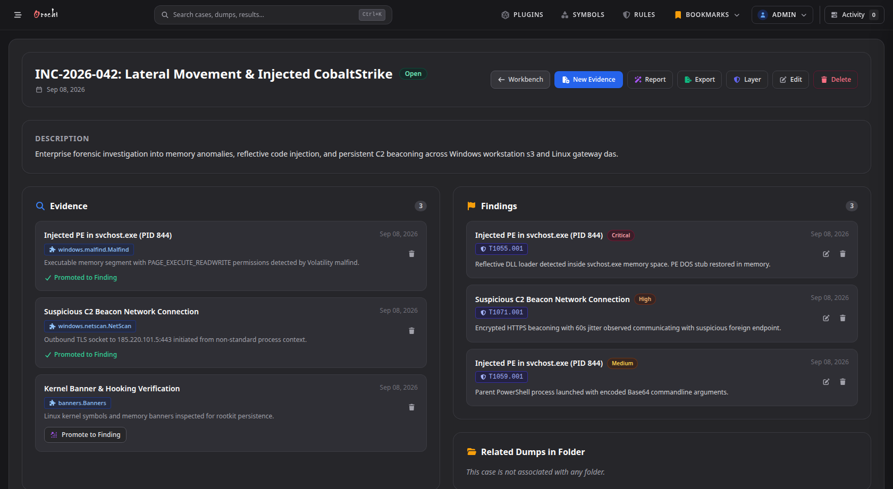

### Automated Incident Timeline
As evidence and findings are added, Orochi automatically compiles a unified **Incident Timeline**. Timeline events chronologically sequence adversary actions and forensic observations, giving analysts an immediate operational picture of the intrusion.

### Incident Reporting & MITRE Navigator Export
- **Case Summary Export**: Export complete case data and findings as structured JSON (`/case_export/<id>`).
- **Templated Audit Reports**: Generate professional incident reports using Jinja/HTML templates (`/case_report/<id>`).
- **AI Executive Summaries (Ollama)**: When generating reports, enable the **Use AI Summary** toggle. Orochi leverages your local **Ollama** LLM to digest all findings, severity levels, and MITRE ATT&CK techniques, generating an executive-ready markdown summary without leaking sensitive data off-premise.
- **MITRE ATT&CK Enterprise Navigator**: Export a tailored MITRE ATT&CK layer file (`/case_mitre_export/<id>`). Uploading this file to the [MITRE ATT&CK Navigator](https://mitre-attack.github.io/attack-navigator/) instantly visualizes all adversary techniques detected during the investigation with heatmaps based on finding severity.

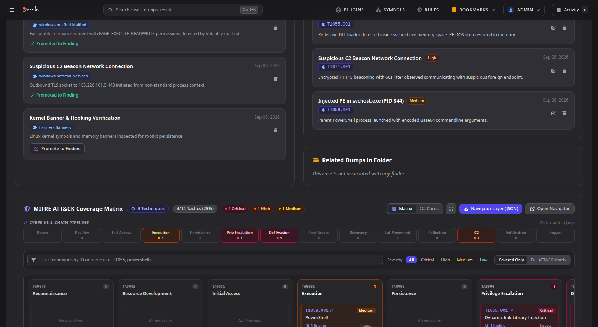

---

## Export to MISP

Orochi integrates with **MISP** for exporting forensic data as structured intelligence.  
You can export single items directly.

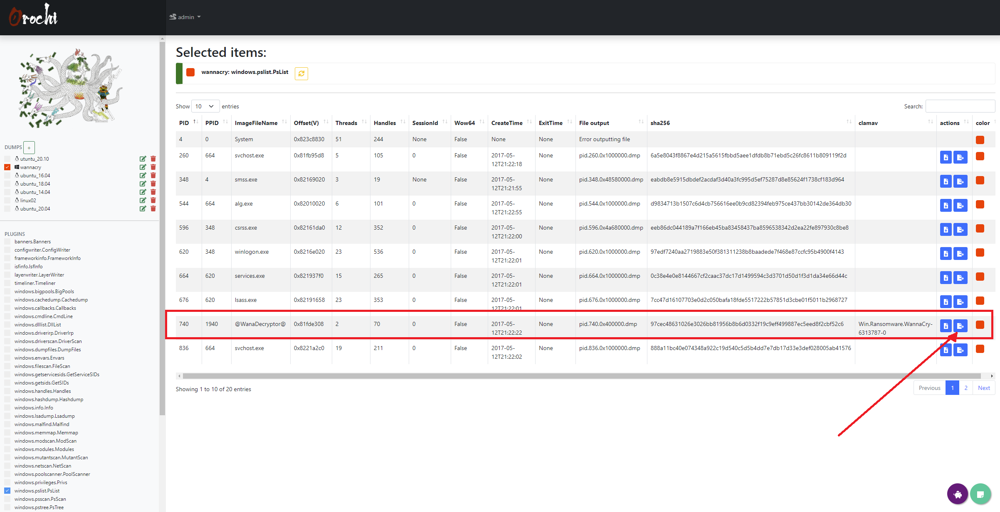

### Result in MISP

Exported files and AV signatures appear as related MISP objects.

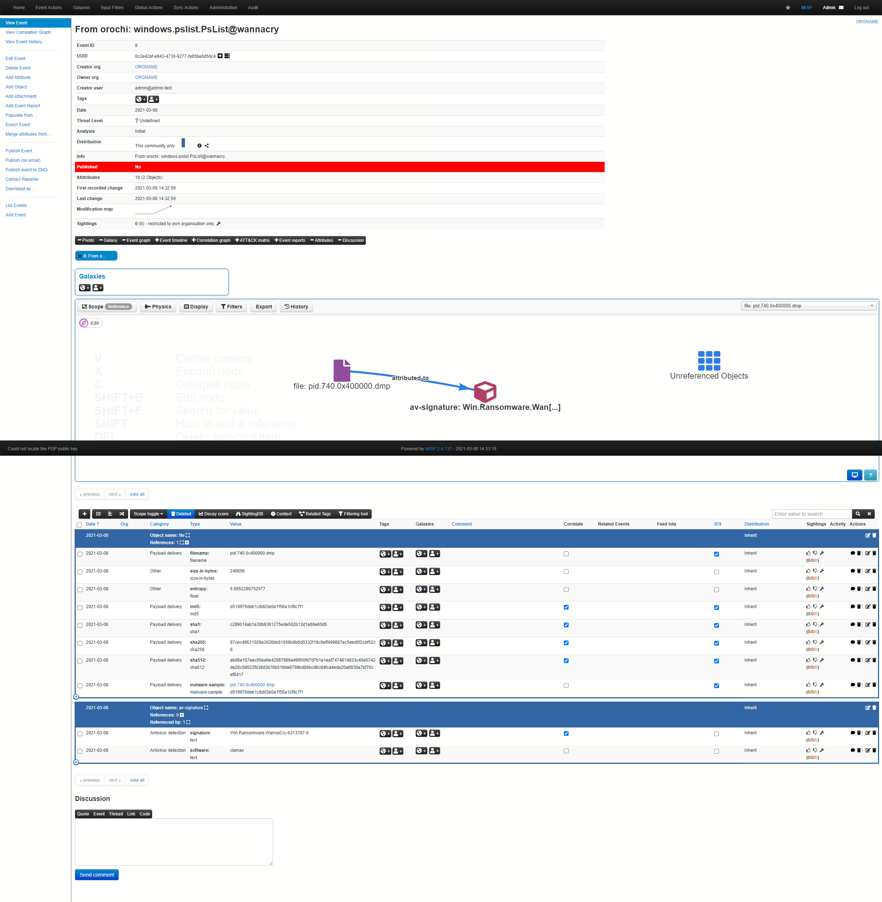

> 🔗 **Note:** Ensure MISP API credentials are configured before exporting.

---

## Deleting Dumps

Deleting a dump removes it and all associated plugin results permanently.

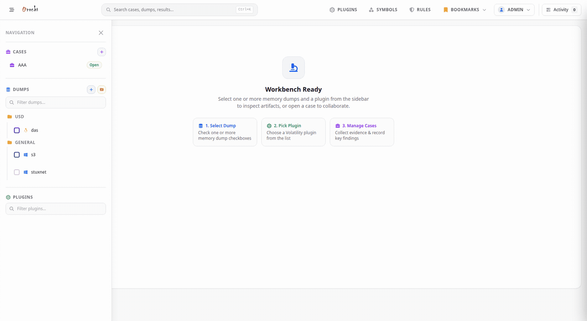

> ⚠️ **Warning:** This action cannot be undone.

---

## YARA

Orochi provides a dedicated interface for managing YARA rules used by Volatility plugins.

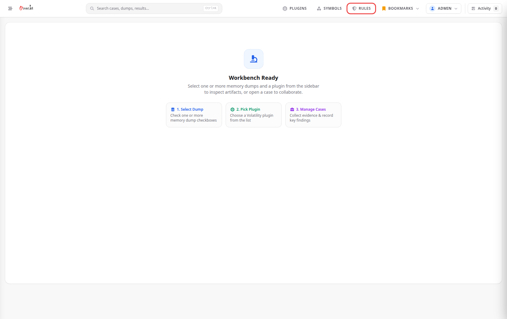

You can:

- View rules imported and enabled by the admin.
- Perform full-text search through PostgreSQL integration.
- Build compiled YARA files for Volatility.
- Choose whether compiled files are **private** or **public**.

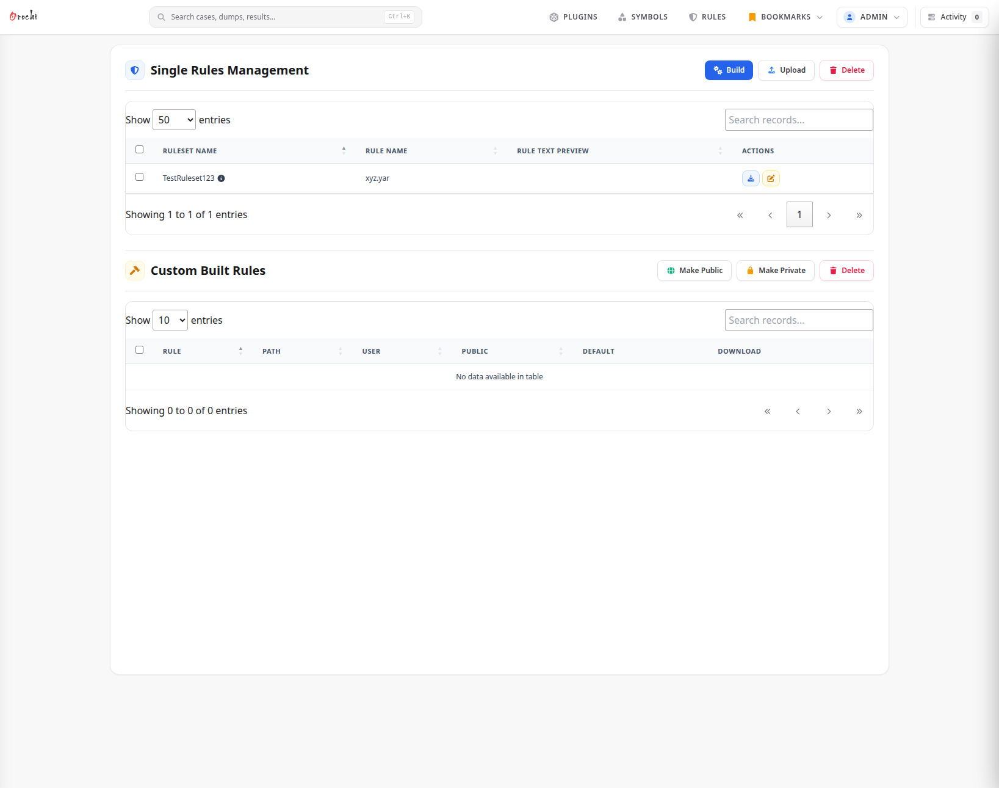

### Example Workflow

1. Search for rules containing “credential”.
2. Select relevant ones.
3. Build a compiled YARA file.
4. Run the Volatility `yara` plugin using that file.


> 🧠 **Tip:** Only the compiled file marked _default_ is used by the Volatility YARA plugin.

---

## HEX Viewer

Orochi includes a remote HEX viewer for browsing dumps directly in the browser.


You can:

- Browse through offsets.
- Jump to a specific address.
- Search for ASCII or hexadecimal values.
- View both hex and ASCII representations.

> ⚡ **Performance Tip:** Large dumps may take several seconds to load depending on size and system resources.

## Interactive JSON Viewer

Orochi incorporates a modern, full-featured interactive JSON viewer (`vanilla-jsoneditor`) to inspect complex forensic structures, plugin configurations, and raw Volatility data.

You can:
- Switch effortlessly between **Tree Mode** (collapsible nodes with property counts), **Table Mode** (flattened tabular view), and **Code Mode** (raw formatted JSON syntax).
- Search, filter, and extract nested keys within large data structures without downloading external files.
- Automatically inherits your selected **Dark** or **Light** theme preference.

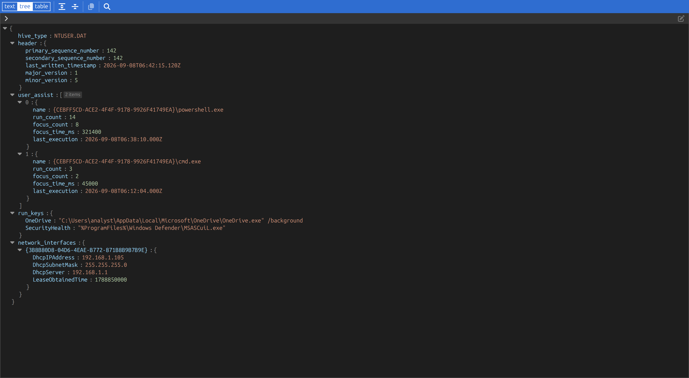

---

## Version Information

- **Application:** Orochi v2.5.0
- **Frameworks:** Django, Dask, Volatility 3
- **License:** MIT
- **Repository:** [https://github.com/LDO-CERT/orochi](https://github.com/LDO-CERT/orochi)

---

© 2026 LDO-CERT — Collaborative Memory Forensics Platform

