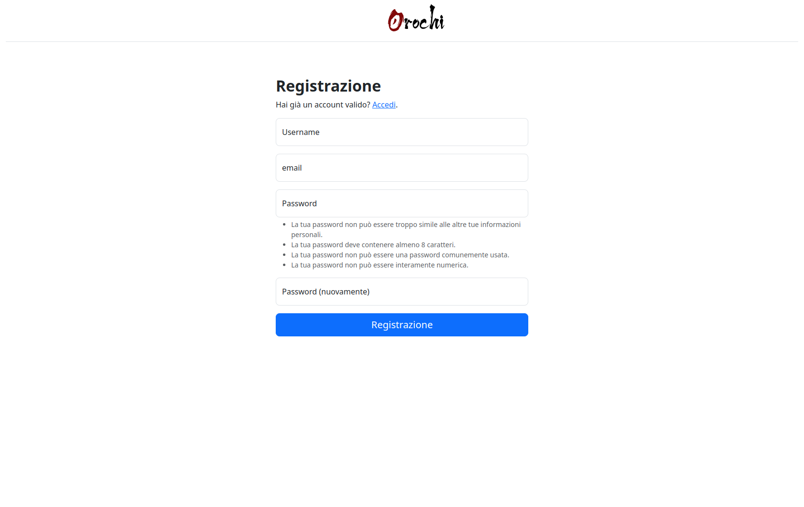

## Table of Contents

- [Table of Contents](#table-of-contents)
- [Concepts](#concepts)
- [Login](#login)
- [Plugins](#plugins)
- [Upload Dump](#upload-dump)
- [Executing Plugins](#executing-plugins)
- [Searching](#searching)
- [Comparing plugin results](#comparing-plugin-results)
- [Sharing Dumps](#sharing-dumps)
- [Deleting Dumps](#deleting-dumps)

## Concepts

Orochi is built on django framework and provides a collaborative GUI to Volatility framework.
Orochi uses DASK to distribute loads between different machines.

## Login

Use sign-up page to register your user and confirm email address through MailHog platform.

## Plugins

Each user can choose which plugins will be executed automatically after uploading a memory dump. If none is selected, user will be able to choose and run any plugin after upload memory dump.

## Upload Dump

To upload a memory dump just click + button near DUMPS, choose file, set name and operative system about dump.
Wait until dump is loaded and then press create index.
Is it possible to choose the color in order to easily distinguish multiple dumps.
To speed up the upload, both raw and zipped dumps are supported.
VmWare Snapshots are also supported, when needed both vmem and vmss, just upload zip file containing both.

## Executing Plugins

A list of plugins will be shown after selecting the dump, then it is possible to selecting single plugin and:
- see the result of plugin if it was set to be run automatically
- run the plugin if it was not set to be run automatically
- re-run the plugin if need to pass some additional parameter (like dump flag, or string file)

A websocket is used to send notifications about plugins execution status

If the plugin ends with an error, a log button will be shown with the relative error.

Plugins will run simultaneously on Dask workers.
By default docker-compose will create for you 2 different worker on the same machine, just to show how to scale. In case you have different machines, you can run workers there and connect to scheduler on main machine.

## Searching

It is possible to perform a full text search through plugin result  thanks to DataTable.
The search works also through multiple dumps, if selected.

## Comparing plugin results

When 2 dumps are selected it is possible to chose a plugin (that was run on both dumps) and visualize simultaneously the results.
In this case the color choosen during upload of dump is useful to identify different dumps.
There is also a function that performs json diff.

## Sharing Dumps

It is possible share dump and results between users.
This function is present under edit dump.
User that uploads the dump is the owner of dump; when dump is shared, other user can see dump, see plugin results, run/rerun plugins, but cannot delete dump.

## Deleting Dumps

Deleting dump function will delete dump and all results of plugins.
